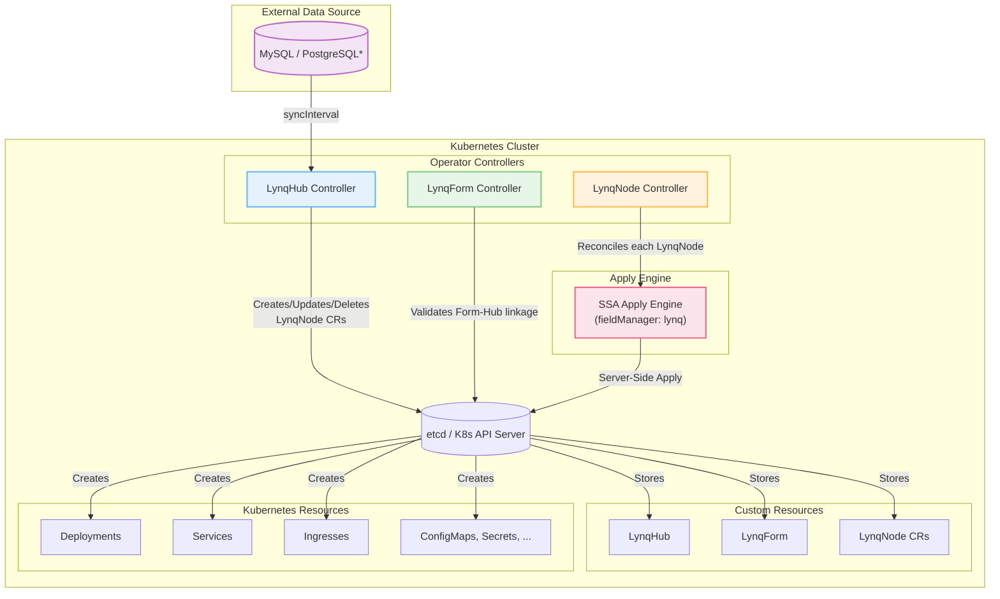
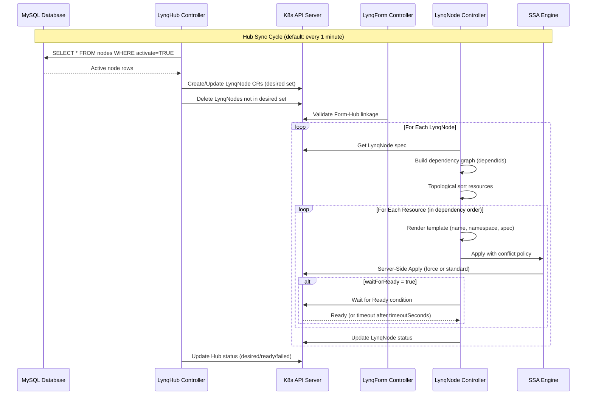

# Architecture

Three controllers, three CRDs, one Server-Side Apply engine. This page covers the system components, reconciliation flow, and key design decisions.

## System Overview


```mermaid
flowchart TB
    subgraph External["External Data Source"]
        DB[(MySQL / PostgreSQL*)]
    end

    subgraph Cluster["Kubernetes Cluster"]
        direction TB

        subgraph Controllers["Operator Controllers"]
            RC[LynqHub Controller]
            TC[LynqForm Controller]
            TNC[LynqNode Controller]
        end

        subgraph CRDs["Custom Resources"]
            TR[LynqHub]
            TT[LynqForm]
            T[LynqNode CRs]
        end

        subgraph Engine["Apply Engine"]
            SSA["SSA Apply Engine<br/>(fieldManager: lynq)"]
        end

        subgraph Resources["Kubernetes Resources"]
            DEP[Deployments]
            SVC[Services]
            ING[Ingresses]
            etc[ConfigMaps, Secrets, ...]
        end

        API[(etcd / K8s API Server)]
    end

    DB -->|"syncInterval"| RC
    RC -->|"Creates/Updates/Deletes<br/>LynqNode CRs"| API
    API -->|"Stores"| TR
    API -->|"Stores"| TT
    API -->|"Stores"| T

    TC -->|"Validates Form-Hub linkage"| API
    TNC -->|"Reconciles each LynqNode"| SSA
    SSA -->|"Server-Side Apply"| API

    API -->|"Creates"| DEP
    API -->|"Creates"| SVC
    API -->|"Creates"| ING
    API -->|"Creates"| etc

    style RC fill:#e3f2fd,stroke:#64b5f6,stroke-width:2px
    style TC fill:#e8f5e9,stroke:#81c784,stroke-width:2px
    style TNC fill:#fff3e0,stroke:#ffb74d,stroke-width:2px
    style SSA fill:#fce4ec,stroke:#f06292,stroke-width:2px
    style DB fill:#f3e5f5,stroke:#ba68c8,stroke-width:2px
```

::: info Datasource support
MySQL: fully supported (v1.0+). PostgreSQL: planned for v1.2.
:::

## Components at a Glance

| Component | Purpose | Example |
|-----------|---------|---------|
| **LynqHub** | Reads database, creates LynqNode CRs | MySQL every 30s → 6 LynqNode CRs |
| **LynqForm** | Resource blueprint per row | Deployment + Service per active node |
| **LynqNode** | Instance for one row × one form | `acme-corp-web-app` → 5 K8s resources |

**Naming**: LynqNode CRs follow `{uid}-{form-name}`. A hub with 3 active rows (`acme`, `beta`, `corp`) and 2 forms (`web-app`, `worker`) creates 6 LynqNodes: `acme-web-app`, `acme-worker`, `beta-web-app`, `beta-worker`, `corp-web-app`, `corp-worker`.

## Reconciliation Flow


```mermaid
sequenceDiagram
    participant DB as MySQL Database
    participant RC as LynqHub Controller
    participant API as K8s API Server
    participant TC as LynqForm Controller
    participant TNC as LynqNode Controller
    participant SSA as SSA Engine

    Note over DB,SSA: Hub Sync Cycle (default: every 1 minute)

    RC->>DB: SELECT * FROM nodes WHERE activate=TRUE
    DB-->>RC: Active node rows

    RC->>API: Create/Update LynqNode CRs (desired set)
    RC->>API: Delete LynqNodes not in desired set

    TC->>API: Validate Form-Hub linkage

    loop For Each LynqNode
        TNC->>API: Get LynqNode spec
        TNC->>TNC: Build dependency graph (dependIds)
        TNC->>TNC: Topological sort resources

        loop For Each Resource (in dependency order)
            TNC->>TNC: Render template (name, namespace, spec)
            TNC->>SSA: Apply with conflict policy
            SSA->>API: Server-Side Apply (force or standard)

            alt waitForReady = true
                TNC->>API: Wait for Ready condition
                API-->>TNC: Ready (or timeout after timeoutSeconds)
            end
        end

        TNC->>API: Update LynqNode status
    end

    RC->>API: Update Hub status (desired/ready/failed)
```

## Three-Controller Design

### LynqHub Controller

Syncs the database on `spec.source.syncInterval` (default: 1m):

1. Queries external datasource; filters rows where `activate` is truthy
2. Calculates desired LynqNode set: `referencingForms × activeRows`
3. Creates missing LynqNode CRs, updates existing ones, deletes excess
4. Emits events: `LynqNodeDeleting`, `LynqNodeDeleted`, `LynqNodeDeletionFailed`
5. Updates `status.{referencingTemplates, desired, ready, failed}`

### LynqForm Controller

Validates form-hub relationships:
- Verifies `spec.hubId` references an existing LynqHub
- Ensures resource IDs are unique within the form
- Validates Go template syntax
- Detects dependency cycles in `dependIds`

### LynqNode Controller

The core reconciler. Runs on LynqNode create/update, resource changes, and 30s periodic requeue:

1. **Finalizer handling** — run cleanup before deletion, then remove finalizer (`lynqnode.operator.lynq.sh/finalizer`)
2. **Template evaluation** — render all resource specs with node data
3. **Orphan detection** — compare `status.appliedResources` with current desired set; handle each orphan per its `DeletionPolicy`
4. **Dependency resolution** — build DAG from `dependIds`; fail fast on cycles
5. **Resource application** — apply in topological order; skip if dependency failed (respects `skipOnDependencyFailure`)
6. **Readiness gate** — wait for Ready condition when `waitForReady: true` (default); timeout at `timeoutSeconds` (default: 300)
7. **Status update** — write `readyResources`, `failedResources`, `desiredResources`, `appliedResources`

## Key Design Patterns

### Server-Side Apply (SSA)

All resources use SSA with `fieldManager: lynq`. This means:
- Operator owns only the fields it sets; other controllers can own other fields
- Conflict detection when another manager owns a field Lynq wants to change
- `ConflictPolicy: Force` overrides with `force=true` flag
- Drift auto-correction: SSA re-applies the desired spec on every reconcile

### Resource Tracking

Two mechanisms, chosen automatically based on namespace and deletion policy:

| Scenario | Mechanism | Why |
|----------|-----------|-----|
| Same-namespace, `DeletionPolicy: Delete` | OwnerReference | Kubernetes GC handles cleanup automatically |
| Cross-namespace, Namespace resources, `DeletionPolicy: Retain` | Labels `lynq.sh/node` + `lynq.sh/node-namespace` | OwnerReferences can't cross namespaces; Retain requires manual lifecycle |

### Dependency Management

```yaml
deployments:
  - id: app
    # ...
services:
  - id: svc
    dependIds: ["app"]   # applies only after app is ready
    waitForReady: true
```

Lynq builds a DAG, detects cycles (fails fast), performs topological sort, and applies in order. Blocked dependencies (not-yet-ready) wait silently; failed dependencies trigger `skipOnDependencyFailure` logic.

### Orphan Resource Management

When a resource is removed from a LynqForm template, Lynq detects it by comparing `status.appliedResources` (previous state) against the current desired set. The stored `DeletionPolicy` annotation determines what happens next:

- **`DeletionPolicy: Delete`** — resource is removed from the cluster
- **`DeletionPolicy: Retain`** — resource receives orphan markers and stays:
  - Label: `lynq.sh/orphaned: "true"`
  - Annotation: `lynq.sh/orphaned-at: "<RFC3339>"`
  - Annotation: `lynq.sh/orphaned-reason: "RemovedFromTemplate"`

Re-adding a resource to the template removes all orphan markers and re-adopts it.

```bash
# Find all orphaned resources cluster-wide
kubectl get all -A -l lynq.sh/orphaned=true
```

## Performance

### Controller Concurrency

```bash
--hub-concurrency=3    # default
--form-concurrency=5   # default
--node-concurrency=10  # default
```

### Watch Predicates

Lynq watches 12 resource types via `Owns()` (same-namespace) and `Watches()` (cross-namespace, label-based). Predicates filter out status-only updates — only generation or annotation changes trigger reconciliation.

### Requeue Strategy

The 30-second periodic requeue (`RequeueAfter: 30s`) ensures child resource status changes (e.g., a Deployment becoming Ready) are reflected in the LynqNode status quickly, without relying solely on watch events.

## See Also

- [Introduction](introduction.md) — what Lynq is and when to use it
- [API Reference](api.md) — full CRD schemas for LynqHub, LynqForm, LynqNode
- [Policies](policies.md) — creation, deletion, and conflict policy reference
- [Dependencies](dependencies.md) — dependency graph, ordering, and failure handling
