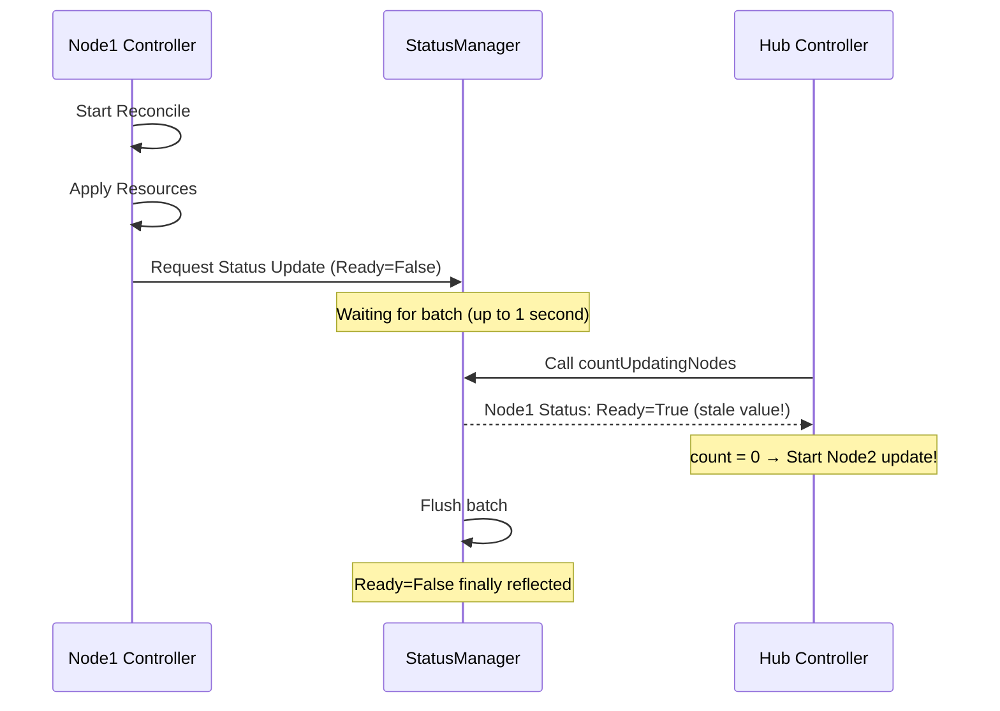
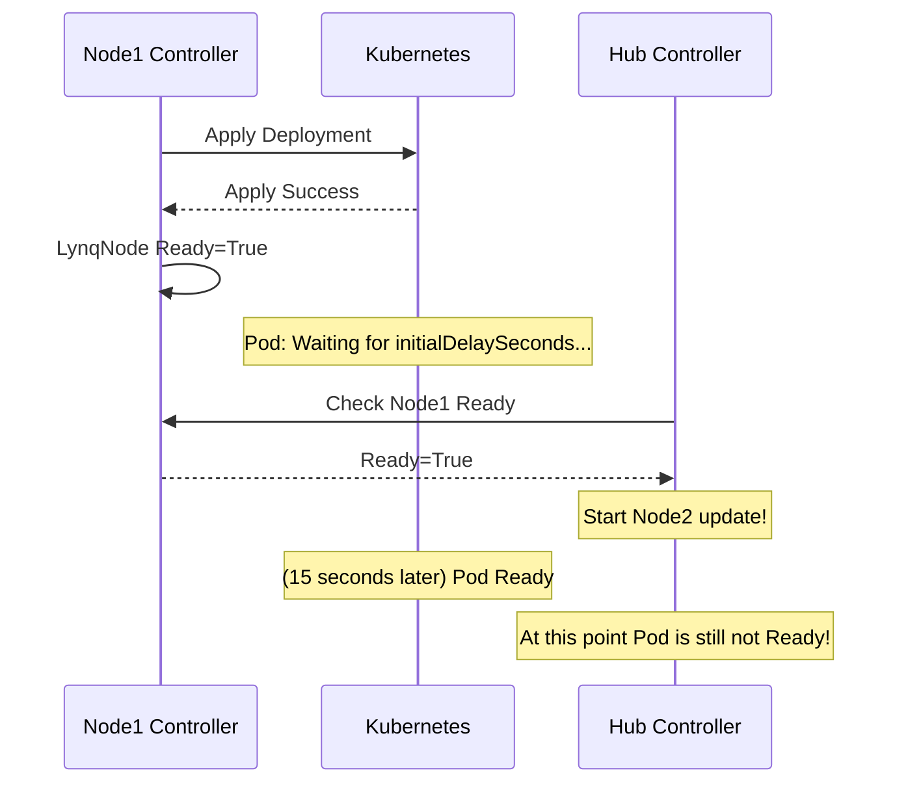

# Implementing maxSkew: How to Safely Update Nodes at Scale

<BlogPostMeta />

One of the most challenging aspects of developing a Kubernetes Operator was handling large-scale rolling updates. What happens when modifying a single template triggers updates across hundreds of nodes simultaneously? This post shares the lessons learned from implementing Lynq Operator's `maxSkew` feature.

## The Problem: Blast Radius

In the RecordOps pattern, a single LynqForm (template) applies to hundreds or thousands of LynqNodes. When you modify the template, all node Deployments must be updated.

```yaml
# What if this single template applies to hundreds of nodes?
apiVersion: lynq.sh/v1
kind: LynqForm
spec:
  deployments:
    - id: app
      spec:
        template:
          spec:
            containers:
              - image: app:v2  # Changed from v1 to v2
```

What if `app:v2` has a bug? All Pods would simultaneously enter CrashLoopBackOff. The entire cluster would be paralyzed.

Even without bugs, updating all nodes at once creates serious problems:

- **Image pull storm**: Hundreds of nodes pulling the same container image simultaneously saturates network bandwidth and can overload the container registry
- **Resource contention**: Old and new Pods running concurrently during rollout doubles CPU and memory consumption, potentially triggering OOM kills
- **API server overload**: Massive concurrent updates flood the Kubernetes API server with requests, slowing down the entire cluster
- **Cascading failures**: If new Pods fail readiness probes, traffic still routes to terminating old Pods, causing request failures across all services

And if there's a bug in the new version, you have no time to react. By the time you notice something is wrong, every single node is already affected.

<BlastRadiusAnimation />

## The Solution: maxSkew

Just as Kubernetes Deployments use `maxSurge` and `maxUnavailable` to control rolling updates, Lynq uses `maxSkew` to limit the number of nodes updating concurrently.

```yaml
apiVersion: lynq.sh/v1
kind: LynqHub
spec:
  rollout:
    maxSkew: 10  # Update at most 10 nodes simultaneously
```

The implementation logic is simple: only start the next node update when the current updating node count is below maxSkew. This is essentially a sliding window approach.

::: tip Feedback Welcome
Currently, Lynq only supports this sliding window rollout strategy. Whether we need other strategies (like canary or blue-green) is still an open question. If you have thoughts or use cases that would benefit from different rollout approaches, please share them on [GitHub Issues](https://github.com/k8s-lynq/lynq/issues).
:::

## First Implementation: Status-Based Counting

The most intuitive approach is to check each LynqNode's Status.

```go
func (r *LynqHubReconciler) countUpdatingNodes(nodes []LynqNode) int {
    count := 0
    for _, node := range nodes {
        if !meta.IsStatusConditionTrue(node.Status.Conditions, "Ready") {
            count++  // Not Ready means updating
        }
    }
    return count
}
```

But this implementation had a critical flaw.

## Discovering the Problem: StatusManager's Batch Processing

During testing, we noticed strange behavior. Even with `maxSkew: 1`, occasionally 2-3 nodes would update simultaneously.

The cause was Lynq StatusManager's batch processing approach:



StatusManager batches Status updates for performance. When Node1's Reconcile starts and applies resources, but the Status hasn't been updated to `Ready=False` yet, the Hub controller calling `countUpdatingNodes` still sees Node1 as Ready.

## Introducing Safety Margin

To solve this race condition, we introduced a time-based Safety Margin. We record the update start time in an Annotation, and regardless of Status, consider the node as "updating" for a certain period.

```go
const safetyMargin = 2 * time.Second

func (r *LynqHubReconciler) countUpdatingNodes(nodes []LynqNode) int {
    count := 0
    for _, node := range nodes {
        // Safety Margin: Handle async Status update delay
        startTime := node.Annotations["rollout-update-start-time"]
        if time.Since(startTime) < safetyMargin {
            count++
            continue
        }

        // Check Status
        if !meta.IsStatusConditionTrue(node.Status.Conditions, "Ready") {
            count++
        }
    }
    return count
}
```

We set it to 2 seconds considering StatusManager's batch flush interval (up to 1 second) plus buffer. Now when a node starts updating, it's counted as updating for at least 2 seconds.

## Second Problem: The Definition of "Ready"

Safety Margin solved the race condition, but E2E tests revealed another issue.

```go
It("should wait for Pod readiness before updating next node", func() {
    // Deployment configured with initialDelaySeconds: 15
    // maxSkew: 1

    // Monitor after template update
    // Expected: Wait for Pod Ready before updating next node
    // Actual: Next node update starts as soon as LynqNode Status becomes Ready=True!
})
```

LynqNode's `Ready` condition indicates whether the resource Apply succeeded. But applying a Deployment doesn't mean the Pod is Ready.



The purpose of `maxSkew` is "limiting the number of nodes updating simultaneously." But our implementation was "limiting the number of nodes applying resources simultaneously." If the next node update starts before the Pod is actually Ready, the blast radius limitation becomes meaningless.

## Solution: Check Actual Resource State

The solution is to directly check the actual Kubernetes resource state, not the LynqNode Status.

```go
func (r *LynqHubReconciler) isNodeResourcesActuallyReady(ctx context.Context, node *LynqNode) bool {
    for _, resource := range node.Status.AppliedResources {
        switch resource.Kind {
        case "Deployment":
            var deploy appsv1.Deployment
            r.Client.Get(ctx, resource.NamespacedName(), &deploy)

            // Key: Check Progressing condition
            progressing := meta.FindStatusCondition(deploy.Status.Conditions, "Progressing")
            if progressing == nil || progressing.Reason != "NewReplicaSetAvailable" {
                return false  // Rollout still in progress
            }

            // Check Available replicas
            if deploy.Status.AvailableReplicas < *deploy.Spec.Replicas {
                return false
            }
        }
    }
    return true
}
```

The key insight is the Deployment's Progressing condition:

| Reason | Meaning |
|--------|---------|
| `ReplicaSetUpdated` | Rollout in progress |
| `NewReplicaSetAvailable` | Rollout complete |
| `ProgressDeadlineExceeded` | Timeout (failed) |

Checking only `AvailableReplicas` isn't enough. Pods from the previous ReplicaSet might still be Running. Only when `Progressing.Reason == "NewReplicaSetAvailable"` is the new version fully deployed.

## Final Implementation

The final implementation combines three conditions:

```go
func (r *LynqHubReconciler) countUpdatingNodes(ctx context.Context, nodes []LynqNode) int {
    count := 0
    for _, node := range nodes {
        // 1. Safety Margin (Handle async Status updates)
        if time.Since(node.UpdateStartTime()) < safetyMargin {
            count++
            continue
        }

        // 2. Check LynqNode Status
        if !meta.IsStatusConditionTrue(node.Status.Conditions, "Ready") {
            count++
            continue
        }

        // 3. Check actual resource state (Key!)
        if !r.isNodeResourcesActuallyReady(ctx, &node) {
            count++
            continue
        }
    }
    return count
}
```

## Lessons Learned

### 1. Recognize Asynchronous Characteristics in Your Implementation

This problem wasn't a Kubernetes characteristic but a Lynq StatusManager design choice. The race condition arose from batching Status updates for performance. If Status were updated synchronously, this problem wouldn't exist. The time-based Safety Margin is a workaround, not a perfect solution. We need to keep exploring better approaches.

### 2. Define "Ready" Clearly

LynqNode being Ready and Pod being Ready are different things. Clearly define what "Ready" means at each layer, and check the appropriate layer's state for your purpose.

### 3. Find the Source of Truth

Sometimes you need to directly query the actual resources, not cached Status, events, or inferences. There's a performance cost, but it's essential for decisions where accuracy matters.

### 4. Understand Deployment Status Conditions

To accurately determine rollout completion, check the `Progressing` condition:

```go
// Rollout completion check
conditions.Progressing.Reason == "NewReplicaSetAvailable" AND
status.AvailableReplicas >= spec.Replicas AND
status.UpdatedReplicas == spec.Replicas
```

### 5. E2E Tests Are Essential

Asynchronous behavior, timing issues, and multi-component interactions are hard to catch with unit tests. Some problems only surface when testing actual rollouts in a real Kubernetes cluster.

## Remaining Challenge: Custom Resource Ready Detection

Deployment, StatefulSet, and DaemonSet have standardized status fields provided by Kubernetes. But what about Custom Resources (CRs)?

```yaml
apiVersion: lynq.sh/v1
kind: LynqForm
spec:
  manifests:
    - id: mysql-cluster
      spec:
        apiVersion: mysql.oracle.com/v2
        kind: InnoDBCluster
        # ...
```

Countless CRs exist: MySQL Operator's `InnoDBCluster`, Prometheus Operator's `ServiceMonitor`, Cert-Manager's `Certificate`, etc. The problem is there's no standardized Ready state for them. Each Operator provider decides their own status representation, making universal Ready detection impossible.

### Problem: Non-Standardized Status Representation

CR status representation varies by Operator:

```yaml
# MySQL Operator - uses status.cluster.status
status:
  cluster:
    status: ONLINE

# Cert-Manager - uses conditions but different type
status:
  conditions:
    - type: Ready
      status: "True"

# Some Operators - no status at all
status: {}
```

Currently, Lynq treats CRs as "Apply success = Ready". But this is risky. Applying an `InnoDBCluster` doesn't mean the MySQL cluster is actually Ready. Cluster setup can take several minutes.

### Potential Solutions

#### 1. Minimum Delay

The simplest approach is to enforce a minimum delay between node updates:

```yaml
apiVersion: lynq.sh/v1
kind: LynqHub
spec:
  rollout:
    maxSkew: 10
    minDelay: 60s  # Wait at least 60 seconds before next node update
```

Even without knowing the exact Ready state, most resources stabilize after sufficient time. The advantage is simple implementation and applicability to all resource types.

The downside is clear: even resources that only need 10 seconds must wait 60 seconds. It's a trade-off between efficiency and safety.

#### 2. Custom Ready Probe

Let users define their own Ready detection logic:

```yaml
apiVersion: lynq.sh/v1
kind: LynqForm
spec:
  manifests:
    - id: mysql-cluster
      spec:
        apiVersion: mysql.oracle.com/v2
        kind: InnoDBCluster
      readyProbe:
        jsonPath: ".status.cluster.status"
        expectedValue: "ONLINE"
```

Flexible, but users need to know each CR's status structure.

#### 3. Leverage Conditions Convention

Many CRs follow Kubernetes' [Conditions convention](https://github.com/kubernetes/community/blob/master/contributors/devel/sig-architecture/api-conventions.md#typical-status-properties):

```go
// Common logic to find type=Ready, status=True
func isCustomResourceReady(cr *unstructured.Unstructured) bool {
    conditions, found, _ := unstructured.NestedSlice(cr.Object, "status", "conditions")
    if !found {
        return false  // Unknown without conditions
    }
    for _, c := range conditions {
        if c["type"] == "Ready" && c["status"] == "True" {
            return true
        }
    }
    return false
}
```

But not all CRs follow this convention.

### Practical Approach: Combined Strategy

In practice, we'll likely need to combine multiple strategies:

1. Default: Check Conditions convention (type=Ready)
2. Fallback: Time-based safety with minDelay
3. Override: User-defined readyProbe for custom logic

```yaml
spec:
  rollout:
    maxSkew: 10
    minDelay: 30s  # Fallback: Minimum wait when Ready detection fails
```

If you have good ideas for this problem, please share them on [GitHub Issues](https://github.com/k8s-lynq/lynq/issues).

## Conclusion

Implementing maxSkew seemed simple but hid unexpected complexity. To answer "how many nodes are currently updating?", we had to dig deep into race conditions from StatusManager's batch processing, Deployment rollout states, and the multi-layered definition of Ready.

And there's still the unresolved challenge of Custom Resource Ready detection. Due to non-standardized status representations, there's no perfect solution, but a practical approach combining time-based safety measures and user-defined probes should be viable.

The most important lesson from this experience: **Performance optimization (batch processing) creates new complexity (race conditions), and "Ready" is defined differently depending on context.** Always keep these two things in mind.

---

The `maxSkew` feature is available starting from **Lynq v1.1.16**. For more details, see the [rollout configuration documentation](/configuration#rollout-configuration).

<BlogPostFooter />
