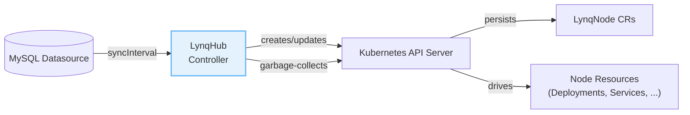
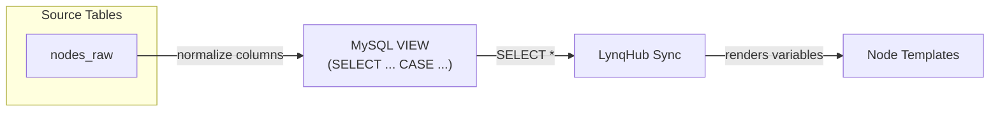
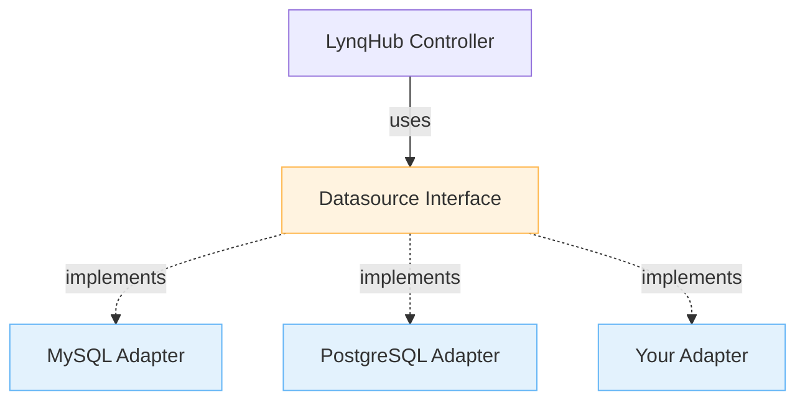

# DataSource Configuration Guide

Complete guide for configuring datasources with Lynq.

[[toc]]

## Overview

Lynq reads node data from external datasources and automatically provisions Kubernetes resources. This guide covers database setup, column mappings, and data transformation techniques.

## Supported Datasources

| Datasource | Status | Since | Guide |
|------------|--------|-------|-------|
| MySQL | ✅ Stable | v1.0 | [MySQL Guide](#mysql-connection) |
| PostgreSQL | 🚧 Planned | v1.2 | Coming soon |
| Custom | 💡 Contribute | - | [Contribution Guide](contributing-datasource.md) |

::: tip Want to Add a Datasource?
Lynq uses a pluggable adapter pattern. Contributing a new datasource is straightforward!
**See**: [Contributing a New Datasource](contributing-datasource.md)
:::



::: info Scope
Examples focus on MySQL (currently supported). PostgreSQL support is planned for v1.2, and the same patterns will apply to other relational sources.
:::

## MySQL Connection

### Basic Configuration

```yaml
apiVersion: operator.lynq.sh/v1
kind: LynqHub
metadata:
  name: my-hub
spec:
  source:
    type: mysql
    mysql:
      host: mysql.default.svc.cluster.local
      port: 3306
      username: node_reader
      passwordRef:
        name: mysql-credentials
        key: password
      database: nodes
      table: node_configs
    syncInterval: 1m
```

### Connection Details

| Field | Description | Default / Recommendation |
| --- | --- | --- |
| `host` | MySQL server hostname or IP | Cluster DNS entry |
| `port` | MySQL server port | `3306` |
| `username` | Database username (use read-only credentials) | `node_reader` |
| `passwordRef` | Reference to a Kubernetes Secret containing the password | `mysql-credentials` |
| `database` | Database name | `nodes` |
| `table` | Table or view containing node data | `node_configs` |
| `syncInterval` | How often to poll the database (e.g., `30s`, `1m`, `5m`) | `1m` |

## Column Mappings

### Required Mappings

Two columns are required for every node:

```yaml
valueMappings:
  uid: node_id             # Unique node identifier
  activate: is_active      # Activation flag
```

::: danger DEPRECATED: hostOrUrl
`hostOrUrl` mapping is **deprecated since v1.1.11** and will be **removed in v1.3.0**.

**Legacy usage (deprecated):**
```yaml
valueMappings:
  uid: node_id
  hostOrUrl: node_url      # ⚠️ DEPRECATED
  activate: is_active
```

**New recommended approach:**
```yaml
valueMappings:
  uid: node_id
  activate: is_active
extraValueMappings:
  nodeUrl: node_url        # ✅ Use extraValueMappings instead

# In template, use toHost() function:
# {{ .nodeUrl | toHost }}  # Extract hostname from URL
```
:::

#### `uid` - Node Identifier

- **Type**: String
- **Required**: Yes
- **Purpose**: Unique identifier for each node
- **Examples**: `"node-123"`, `"acme-corp"`, `"customer-456"`
- **Used in**: Resource naming, labels, template variables

#### `activate` - Activation Flag ⚠️

- **Type**: String (truthy values)
- **Required**: Yes
- **Purpose**: Controls whether node resources are created

::: warning Activation rules
| Accepted values (case-sensitive) | Result |
| --- | --- |
| `"1"`, `"true"`, `"TRUE"`, `"True"`, `"yes"`, `"YES"`, `"Yes"` | Node is marked **active** and resources reconcile. |

| Rejected values | Result |
| --- | --- |
| `"0"`, `"false"`, `"FALSE"`, `"no"`, `""`, `NULL`, any other string | Node is **ignored** during sync. |

- Only the exact accepted strings above are considered active.
- Boolean columns work if they stringify to `"1"` or `"true"`.
- Integer columns (`TINYINT`) work when they return the string `"1"`.
:::

### Extra Mappings

Add custom variables for use in templates:

::: v-pre
```yaml
extraValueMappings:
  planId: subscription_plan        # Maps "subscription_plan" column to {{ .planId }}
  region: deployment_region        # Maps "deployment_region" column to {{ .region }}
  maxUsers: max_user_count         # Maps "max_user_count" column to {{ .maxUsers }}
  apiKey: api_token                # Maps "api_token" column to {{ .apiKey }}
```

These variables become available in all templates as `{{ .planId }}`, `{{ .region }}`, etc.
:::

## Database Schema Examples

### Example 1: Simple Node Table

```sql
CREATE TABLE node_configs (
    node_id VARCHAR(255) PRIMARY KEY,
    node_url VARCHAR(500) NOT NULL,
    is_active TINYINT(1) DEFAULT 0,
    subscription_plan VARCHAR(50),
    deployment_region VARCHAR(50),
    created_at TIMESTAMP DEFAULT CURRENT_TIMESTAMP
);

-- Sample data
INSERT INTO node_configs (node_id, node_url, is_active, subscription_plan, deployment_region) VALUES
    ('acme-corp', 'https://acme.example.com', 1, 'enterprise', 'us-east-1'),
    ('beta-inc', 'https://beta.example.com', 1, 'startup', 'eu-west-1'),
    ('gamma-llc', 'https://gamma.example.com', 0, 'trial', 'ap-south-1');  -- Not active
```

**Hub Configuration:**
```yaml
valueMappings:
  uid: node_id
  hostOrUrl: node_url
  activate: is_active
extraValueMappings:
  planId: subscription_plan
  region: deployment_region
```

### Example 2: Boolean and String Activate Column

```sql
-- Option A: TINYINT (returns "1" or "0" as string)
CREATE TABLE nodes (
    id VARCHAR(255) PRIMARY KEY,
    url VARCHAR(500),
    active TINYINT(1) DEFAULT 0  -- ✅ Returns "1" (truthy) or "0" (falsy)
);

-- Option B: VARCHAR with explicit values
CREATE TABLE nodes (
    id VARCHAR(255) PRIMARY KEY,
    url VARCHAR(500),
    status VARCHAR(20) DEFAULT 'inactive'  -- Values: "active" or "inactive"
);

-- Option C: BOOLEAN (MySQL stores as TINYINT)
CREATE TABLE nodes (
    id VARCHAR(255) PRIMARY KEY,
    url VARCHAR(500),
    enabled BOOLEAN DEFAULT FALSE  -- ✅ Returns "1" or "0" as string
);
```

**Hub Configurations:**

For Option A or C (TINYINT/BOOLEAN):
```yaml
valueMappings:
  uid: id
  hostOrUrl: url
  activate: active  # ✅ "1" is truthy, "0" is falsy
```

For Option B (VARCHAR status):
```yaml
# ❌ Won't work directly - "active" is not a valid truthy value
# Use a VIEW with transformation (see below)
```

## Data Transformation with Views

If your database schema doesn't match the required format, create a MySQL VIEW to transform data.



### Use Case 1: Transform Status String to Truthy Value

**Problem:** Your `status` column has values like `"active"`, `"inactive"`, `"suspended"`

**Solution:** Create a view that maps to truthy values:

```sql
CREATE VIEW node_configs AS
SELECT
    id AS node_id,
    url AS node_url,
    CASE
        WHEN status = 'active' THEN '1'
        ELSE '0'
    END AS is_active,
    plan AS subscription_plan,
    region AS deployment_region
FROM nodes
WHERE status IN ('active', 'inactive');  -- Exclude suspended
```

**Hub Configuration:**
```yaml
spec:
  source:
    mysql:
      table: node_configs  # ✅ Use VIEW name, not original table
  valueMappings:
    uid: node_id
    hostOrUrl: node_url
    activate: is_active       # ✅ Now returns "1" or "0"
```

### Use Case 2: Combine Multiple Columns

**Problem:** Node URL is split across multiple columns

```sql
-- Original table
CREATE TABLE customers (
    customer_id INT PRIMARY KEY,
    subdomain VARCHAR(100),
    domain VARCHAR(100),  -- e.g., "myapp.com"
    enabled TINYINT(1)
);

-- View to combine columns
CREATE VIEW node_configs AS
SELECT
    CONCAT('customer-', customer_id) AS node_id,
    CONCAT('https://', subdomain, '.', domain) AS node_url,
    IF(enabled = 1, '1', '0') AS is_active
FROM customers
WHERE enabled = 1;
```

### Use Case 3: Filter and Transform

**Problem:** You want to exclude certain nodes or apply business logic

```sql
CREATE VIEW active_paying_nodes AS
SELECT
    node_id,
    node_url,
    '1' AS is_active,  -- Always active in this view
    subscription_tier,
    MAX(license_count) AS max_users
FROM nodes n
JOIN subscriptions s ON n.id = s.node_id
WHERE
    s.status = 'active'
    AND s.payment_status = 'paid'
    AND s.expiry_date > NOW()
GROUP BY node_id, node_url, subscription_tier;
```

### Use Case 4: Add Computed Columns

**Problem:** You need derived data in templates

```sql
CREATE VIEW node_configs AS
SELECT
    node_id,
    node_url,
    is_active,
    subscription_plan,
    -- Computed columns
    CONCAT('https://cdn-', deployment_region, '.example.com') AS cdn_url,
    CASE subscription_plan
        WHEN 'enterprise' THEN '100'
        WHEN 'business' THEN '50'
        ELSE '10'
    END AS max_replicas,
    DATE_FORMAT(created_at, '%Y-%m-%d') AS created_date
FROM nodes;
```

**Use in templates:**
::: v-pre
```yaml
extraValueMappings:
  cdnUrl: cdn_url
  maxReplicas: max_replicas
  createdDate: created_date
```

```yaml
# In deployment template
spec:
  replicas: {{ .maxReplicas }}  # Uses computed value
  containers:
  - name: app
    env:
    - name: CDN_URL
      value: "{{ .cdnUrl }}"
```
:::

## Best Practices

### 1. Use Read-Only Database User

```sql
-- Create read-only user
CREATE USER 'node_reader'@'%' IDENTIFIED BY 'secure_password';
GRANT SELECT ON nodes.node_configs TO 'node_reader'@'%';
FLUSH PRIVILEGES;
```

### 2. Use Views for Data Isolation

```sql
-- Original table has sensitive data
CREATE TABLE nodes_internal (
    id VARCHAR(255),
    url VARCHAR(500),
    active TINYINT(1),
    api_secret VARCHAR(500),      -- Sensitive!
    billing_email VARCHAR(255),   -- Sensitive!
    internal_notes TEXT           -- Sensitive!
);

-- View exposes only necessary columns
CREATE VIEW node_configs AS
SELECT
    id AS node_id,
    url AS node_url,
    IF(active = 1, '1', '0') AS is_active
FROM nodes_internal;

-- Grant access only to view
GRANT SELECT ON nodes.node_configs TO 'node_reader'@'%';
```

### 3. Add Indexes for Performance

```sql
-- Index on activation column for faster filtering
CREATE INDEX idx_active ON nodes(is_active);

-- Composite index for common queries
CREATE INDEX idx_active_created ON nodes(is_active, created_at);
```

### 4. Validate Data Before Deployment

```sql
-- Check for invalid activate values
SELECT node_id, is_active
FROM node_configs
WHERE is_active NOT IN ('0', '1', 'true', 'false', 'yes', 'no');

-- Check for missing required fields
SELECT node_id
FROM node_configs
WHERE node_url IS NULL OR node_url = '';

-- Check for duplicate UIDs
SELECT node_id, COUNT(*) as count
FROM node_configs
GROUP BY node_id
HAVING count > 1;
```

### 5. Complete VIEW Verification Checklist

Before connecting Lynq to your VIEW, verify it meets all requirements:

**Step 1: Verify Required Columns Exist**

```sql
-- Check VIEW structure
DESCRIBE node_configs;

-- Expected output:
-- +-------------------+--------------+------+-----+---------+-------+
-- | Field             | Type         | Null | Key | Default | Extra |
-- +-------------------+--------------+------+-----+---------+-------+
-- | node_id           | varchar(255) | YES  |     | NULL    |       |  ✅ Required (uid)
-- | is_active         | varchar(1)   | YES  |     | NULL    |       |  ✅ Required (activate)
-- | node_url          | varchar(500) | YES  |     | NULL    |       |  Optional
-- | subscription_plan | varchar(50)  | YES  |     | NULL    |       |  Extra mapping
-- +-------------------+--------------+------+-----+---------+-------+
```

**Step 2: Verify Data Types**

```sql
-- Check actual data returned
SELECT
    node_id,
    TYPEOF(node_id) AS uid_type,
    is_active,
    TYPEOF(is_active) AS activate_type
FROM node_configs
LIMIT 5;

-- All values should be strings
-- is_active should be '0' or '1' (not 0 or 1 as integers)
```

**Step 3: Verify Activation Values**

```sql
-- Count by activation value (should see only valid values)
SELECT
    is_active,
    COUNT(*) as count,
    CASE
        WHEN is_active IN ('1', 'true', 'TRUE', 'yes', 'YES') THEN '✅ Active'
        WHEN is_active IN ('0', 'false', 'FALSE', 'no', 'NO', '') THEN '⏸️ Inactive'
        ELSE '❌ Invalid'
    END AS status
FROM node_configs
GROUP BY is_active;

-- Example good output:
-- +----------+-------+-----------+
-- | is_active| count | status    |
-- +----------+-------+-----------+
-- | 1        |    5  | ✅ Active  |
-- | 0        |    3  | ⏸️ Inactive |
-- +----------+-------+-----------+
```

**Step 4: Verify No Duplicate UIDs**

```sql
-- Should return empty result set
SELECT node_id, COUNT(*) as count
FROM node_configs
GROUP BY node_id
HAVING count > 1;

-- If duplicates found, fix your VIEW:
-- Option A: Add DISTINCT
-- Option B: Add GROUP BY
-- Option C: Fix source data
```

**Step 5: Verify No NULL UIDs**

```sql
-- Should return empty result set
SELECT * FROM node_configs WHERE node_id IS NULL OR node_id = '';
```

**Step 6: Preview What Lynq Will See**

```sql
-- This query mimics what the operator runs
SELECT * FROM node_configs;

-- Check the result:
-- 1. All expected rows appear
-- 2. UIDs are unique and non-empty
-- 3. activate values are valid
-- 4. Extra columns contain expected data
```

**Step 7: Test with Read-Only User**

```bash
# Connect as the user Lynq will use
mysql -h mysql-server -u node_reader -p

# Run the same query
mysql> SELECT * FROM mydb.node_configs;

# Verify results match Step 6
```

**Step 8: Verify from Kubernetes**

```bash
# Test connectivity from cluster
kubectl run mysql-test --rm -it --image=mysql:8 -- \
  mysql -h mysql.default.svc.cluster.local \
        -u node_reader \
        -p'your-password' \
        -e "SELECT * FROM mydb.node_configs"

# Expected: Same output as Step 6
```

**Complete Verification Script:**

```sql
-- Run this script to validate your VIEW before deployment
-- Save as verify_view.sql and run: mysql -u root < verify_view.sql

USE mydb;

-- 1. Structure check
SELECT '=== STEP 1: VIEW Structure ===' AS step;
DESCRIBE node_configs;

-- 2. Required columns check
SELECT '=== STEP 2: Required Columns ===' AS step;
SELECT
    MAX(CASE WHEN COLUMN_NAME = 'node_id' THEN 'FOUND' ELSE 'MISSING' END) AS uid_column,
    MAX(CASE WHEN COLUMN_NAME = 'is_active' THEN 'FOUND' ELSE 'MISSING' END) AS activate_column
FROM INFORMATION_SCHEMA.COLUMNS
WHERE TABLE_SCHEMA = 'mydb' AND TABLE_NAME = 'node_configs';

-- 3. Data validation
SELECT '=== STEP 3: Activation Value Distribution ===' AS step;
SELECT is_active, COUNT(*) as count FROM node_configs GROUP BY is_active;

-- 4. Duplicate check
SELECT '=== STEP 4: Duplicate UIDs (should be empty) ===' AS step;
SELECT node_id, COUNT(*) FROM node_configs GROUP BY node_id HAVING COUNT(*) > 1;

-- 5. NULL check
SELECT '=== STEP 5: NULL UIDs (should be empty) ===' AS step;
SELECT * FROM node_configs WHERE node_id IS NULL OR node_id = '';

-- 6. Sample data
SELECT '=== STEP 6: Sample Data Preview ===' AS step;
SELECT * FROM node_configs LIMIT 10;

-- 7. Active node count
SELECT '=== STEP 7: Expected LynqNodes ===' AS step;
SELECT COUNT(*) AS expected_lynqnodes FROM node_configs WHERE is_active IN ('1', 'true', 'TRUE', 'yes', 'YES');
```

**Expected Lynq Behavior After Verification:**

```bash
# After deploying LynqHub, verify operator synced correctly
$ kubectl get lynqhub production-nodes -o jsonpath='{.status}'

# Expected:
# {
#   "desired": 5,                    # Matches Step 7 count
#   "ready": 5,
#   "failed": 0,
#   "referencingTemplates": 1,
#   "conditions": [{
#     "type": "Ready",
#     "status": "True",
#     "reason": "SyncSucceeded",
#     "message": "Successfully synced 5 nodes from database"
#   }]
# }

# List created LynqNodes
$ kubectl get lynqnodes
NAME          READY   DESIRED   AGE
node-1        5/5     5         1m
node-2        5/5     5         1m
node-3        5/5     5         1m
node-4        5/5     5         1m
node-5        5/5     5         1m
```

### 5. Use Appropriate Sync Intervals

```yaml
# High-frequency (more API calls, faster sync)
syncInterval: 30s   # For development/testing

# Medium-frequency (balanced)
syncInterval: 1m    # Recommended for production

# Low-frequency (fewer API calls, slower sync)
syncInterval: 5m    # For large deployments (1000+ nodes)
```

## Troubleshooting

### Problem: Nodes Not Being Created

**Check 1: Verify `activate` column values**
```sql
SELECT node_id, is_active,
    CASE is_active
        WHEN '1' THEN '✅ Valid'
        WHEN 'true' THEN '✅ Valid'
        WHEN 'TRUE' THEN '✅ Valid'
        WHEN 'yes' THEN '✅ Valid'
        ELSE '❌ Invalid'
    END AS status
FROM node_configs;
```

**Check 2: Query what operator sees**
```sql
-- Run the exact query operator uses
SELECT node_id, node_url, is_active
FROM node_configs;
```

**Check 3: Check operator logs**
```bash
kubectl logs -n lynq-system -l control-plane=controller-manager | grep -i "query\|node"
```

### Problem: View Not Updating

**Solution 1: Refresh view definition**
```sql
DROP VIEW IF EXISTS node_configs;
CREATE VIEW node_configs AS
SELECT ...;
```

**Solution 2: Check view dependencies**
```sql
SHOW CREATE VIEW node_configs;
```

### Problem: Connection Errors

**Check database accessibility from cluster:**
```bash
kubectl run mysql-test --rm -it --image=mysql:8 -- \
  mysql -h mysql.default.svc.cluster.local -u node_reader -p
```

**Check credentials:**
```bash
# Verify secret exists
kubectl get secret mysql-secret -o yaml

# Decode password
kubectl get secret mysql-secret -o jsonpath='{.data.password}' | base64 -d
```

## Complete Example

### Database Setup

```sql
-- Create main nodes table
CREATE TABLE nodes (
    id INT AUTO_INCREMENT PRIMARY KEY,
    company_name VARCHAR(255) NOT NULL,
    subdomain VARCHAR(100) NOT NULL UNIQUE,
    status ENUM('active', 'suspended', 'trial') DEFAULT 'trial',
    plan VARCHAR(50) DEFAULT 'free',
    region VARCHAR(50) DEFAULT 'us-east-1',
    max_users INT DEFAULT 5,
    created_at TIMESTAMP DEFAULT CURRENT_TIMESTAMP,
    updated_at TIMESTAMP DEFAULT CURRENT_TIMESTAMP ON UPDATE CURRENT_TIMESTAMP
);

-- Create transformation view
CREATE VIEW node_configs AS
SELECT
    CONCAT('node-', id) AS node_id,
    CONCAT('https://', subdomain, '.myapp.com') AS node_url,
    CASE status
        WHEN 'active' THEN '1'
        WHEN 'trial' THEN '1'
        ELSE '0'
    END AS is_active,
    plan AS subscription_plan,
    region AS deployment_region,
    max_users AS max_user_count
FROM nodes;

-- Create read-only user
CREATE USER 'node_reader'@'%' IDENTIFIED BY 'secure_password_here';
GRANT SELECT ON mydb.node_configs TO 'node_reader'@'%';
FLUSH PRIVILEGES;

-- Insert sample data
INSERT INTO nodes (company_name, subdomain, status, plan, region, max_users) VALUES
    ('Acme Corp', 'acme', 'active', 'enterprise', 'us-east-1', 100),
    ('Beta Inc', 'beta', 'trial', 'startup', 'eu-west-1', 10),
    ('Gamma LLC', 'gamma', 'suspended', 'free', 'ap-south-1', 5);
```

### Kubernetes Secret

```yaml
apiVersion: v1
kind: Secret
metadata:
  name: mysql-credentials
  namespace: lynq-system
type: Opaque
stringData:
  password: secure_password_here
```

### LynqHub

```yaml
apiVersion: operator.lynq.sh/v1
kind: LynqHub
metadata:
  name: production-nodes
spec:
  source:
    type: mysql
    mysql:
      host: mysql.default.svc.cluster.local
      port: 3306
      username: node_reader
      passwordRef:
        name: mysql-credentials
        key: password
      database: mydb
      table: node_configs  # ✅ Use view name
    syncInterval: 1m

  valueMappings:
    uid: node_id
    hostOrUrl: node_url
    activate: is_active

  extraValueMappings:
    planId: subscription_plan
    region: deployment_region
    maxUsers: max_user_count
```

### Query Results

```
node_id        node_url                        is_active  subscription_plan  deployment_region  max_user_count
-------------- ------------------------------- ---------- ------------------ ------------------ --------------
node-1         https://acme.myapp.com          1          enterprise         us-east-1          100
node-2         https://beta.myapp.com          1          startup            eu-west-1          10
node-3         https://gamma.myapp.com         0          free               ap-south-1         5
```

**Result:** 2 LynqNode CRs created (node-1, node-2). node-3 is skipped because `is_active = "0"`.

## Contributing a New Datasource

Want to add support for PostgreSQL, MongoDB, REST APIs, or other datasources?

Lynq uses a **pluggable adapter pattern** that makes it easy to add new datasources. You only need to:

1. **Implement 2 methods**: `QueryNodes()` and `Close()`
2. **Register your adapter**: Add it to the factory function
3. **Add API types**: Define your datasource configuration
4. **Write tests**: Ensure quality and reliability
5. **Document**: Help users configure your datasource

### Why Contribute?

- ✅ **Easy to implement** - Clear interface, reference implementation
- ✅ **Well-structured** - Adapter pattern isolates your code
- ✅ **Impactful** - Help the community use their preferred datasources
- ✅ **Recognized** - Contributors listed in release notes and README

### Getting Started

**📚 Full Guide**: [Contributing a New Datasource](contributing-datasource.md)

The guide includes:
- Step-by-step implementation instructions
- Complete code examples (including PostgreSQL)
- Testing strategies
- Documentation templates
- PR checklist

### Example Adapters

**MySQL** (reference implementation):
- Location: `internal/datasource/mysql.go`
- Lines of code: ~200
- Features: Connection pooling, filtering, mapping

**PostgreSQL** (example in guide):
- Full implementation shown
- Shows SQL dialect differences
- Demonstrates best practices

### Architecture



### Quick Start

```go
// 1. Create your adapter file
// internal/datasource/your_adapter.go

package datasource

type YourAdapter struct {
    conn *YourConnection
}

func NewYourAdapter(config Config) (*YourAdapter, error) {
    // Connect to your datasource
    return &YourAdapter{conn: conn}, nil
}

func (a *YourAdapter) QueryNodes(ctx context.Context, config QueryConfig) ([]NodeRow, error) {
    // Query and return node data
    return nodes, nil
}

func (a *YourAdapter) Close() error {
    // Cleanup
    return a.conn.Close()
}

// 2. Register in factory (internal/datasource/interface.go)
case SourceTypeYours:
    return NewYourAdapter(config)
```

### Community Support

Need help? We're here!

- 💬 [GitHub Discussions](https://github.com/k8s-lynq/lynq/discussions) - Ask questions
- 📖 [Full Guide](contributing-datasource.md) - Detailed instructions
- 🐛 [Issues](https://github.com/k8s-lynq/lynq/issues) - Report problems
- 📧 [Email](mailto:rationlunas@gmail.com) - Direct contact

Start contributing today and make Lynq work with your favorite datasource! 🚀

## See Also

- [Configuration Guide](configuration.md) - Hub and template configuration
- [Templates Guide](templates.md) - Using template variables
- [Security Guide](security.md) - Securing database credentials
- [Troubleshooting Guide](troubleshooting.md) - Common issues and solutions
- [Contributing a New Datasource](contributing-datasource.md) - Full contribution guide
