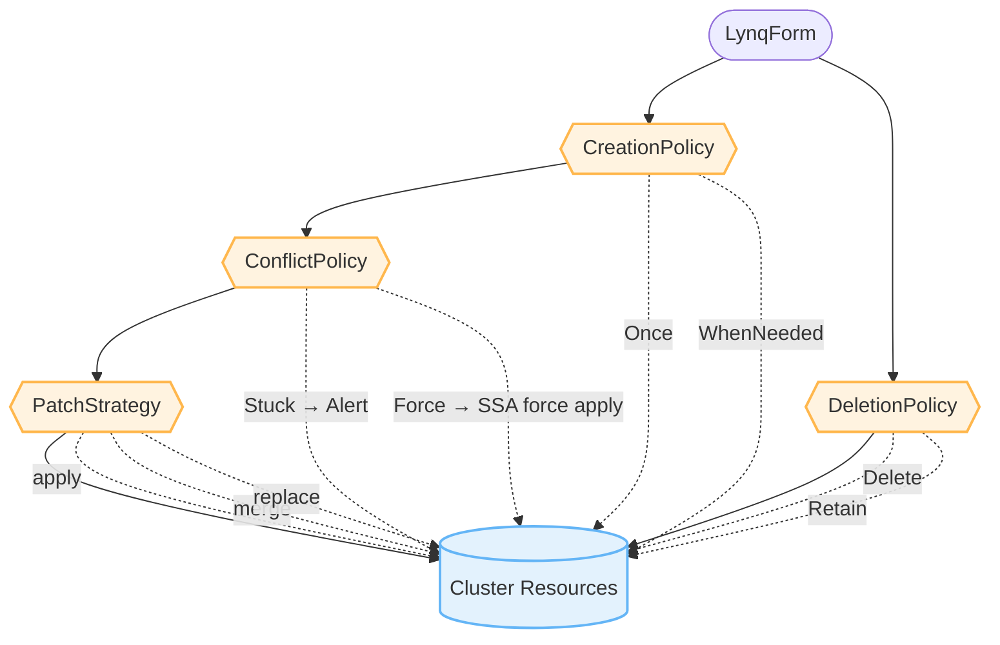
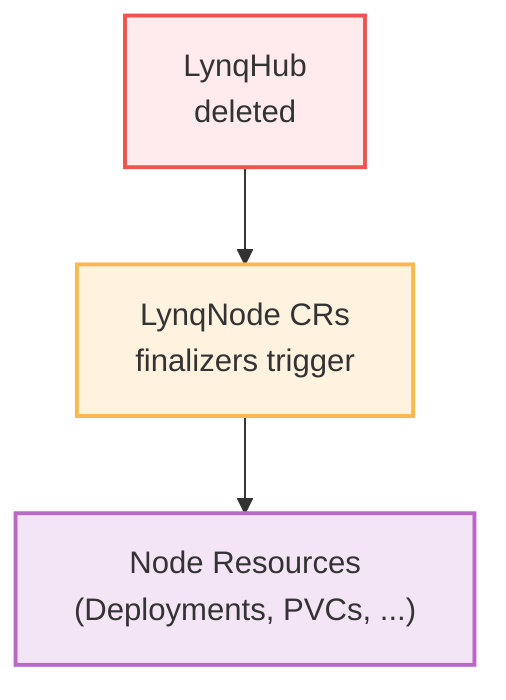

# Policies Guide

Lynq provides fine-grained control over resource lifecycle through four policy types. This guide explains each policy and when to use them.

[[toc]]

## Policy Types Overview

| Policy | Controls | Default | Options |
|--------|----------|---------|---------|
| CreationPolicy | When resources are created | `WhenNeeded` | `Once`, `WhenNeeded` |
| DeletionPolicy | What happens on delete | `Delete` | `Delete`, `Retain` |
| ConflictPolicy | Ownership conflict handling | `Stuck` | `Stuck`, `Force` |
| PatchStrategy | How resources are updated | `apply` | `apply`, `merge`, `replace` |

::: tip Practical Examples
See [Policy Combinations Examples](policies-examples.md) for detailed real-world scenarios with diagrams and step-by-step explanations.
:::

::: tip Field-Level Control (v1.1.4+)
For fine-grained control over specific fields while using `WhenNeeded`, see [Field-Level Ignore Control](field-ignore.md). This allows you to selectively ignore certain fields during reconciliation (e.g., HPA-managed replicas).
:::



## CreationPolicy

Controls when a resource is created or re-applied.

<CreationPolicyVisualizer />

### `WhenNeeded` (Default)

Resource is created and updated whenever the spec changes.

```yaml
deployments:
  - id: app
    creationPolicy: WhenNeeded  # Default
    nameTemplate: "{{ .uid }}-app"
    spec:
      # ... deployment spec
```

**Behavior:**
- ✅ Creates resource if it doesn't exist
- ✅ Updates resource when spec changes
- ✅ Re-applies if manually deleted
- ✅ Maintains desired state continuously

**Use when:**
- Resources should stay synchronized with templates
- You want drift correction
- Resource state should match database

**Example:** Application deployments, services, configmaps

::: tip Alternative: Use ignoreFields
If you need to update most fields but ignore specific ones (e.g., replicas controlled by HPA), consider using `creationPolicy: WhenNeeded` with `ignoreFields` instead of using `Once`. This provides more flexibility while still allowing selective field updates. See [Field-Level Ignore Control](field-ignore.md) for details.
:::

### `Once`

Resource is created only once and never updated, even if spec changes.

```yaml
jobs:
  - id: init-job
    creationPolicy: Once
    nameTemplate: "{{ .uid }}-init"
    spec:
      apiVersion: batch/v1
      kind: Job
      spec:
        template:
          spec:
            containers:
            - name: init
              image: busybox
              command: ["sh", "-c", "echo Initializing node {{ .uid }}"]
            restartPolicy: Never
```

**Behavior:**
- ✅ Creates resource on first reconciliation
- ❌ Never updates resource, even if template changes
- ✅ Skips if resource already exists with `lynq.sh/created-once` annotation
- ✅ Re-creates if manually deleted

**Use when:**
- One-time initialization tasks
- Security resources that shouldn't change
- Database migrations
- Initial setup jobs

**Example:** Init Jobs, security configurations, bootstrap scripts

**Annotation Added:**
```yaml
metadata:
  annotations:
    lynq.sh/created-once: "true"
```

## DeletionPolicy

Controls what happens to resources when a LynqNode CR is deleted.

<DeletionPolicyVisualizer />

### `Delete` (Default)

Resources are deleted when the Node is deleted via ownerReference.

```yaml
deployments:
  - id: app
    deletionPolicy: Delete  # Default
    nameTemplate: "{{ .uid }}-app"
    spec:
      # ... deployment spec
```

**Behavior:**
- ✅ Removes resource from cluster automatically
- ✅ Uses ownerReference for garbage collection
- ✅ No orphaned resources

**Use when:**
- Resources are node-specific and should be removed
- You want complete cleanup
- Resources have no value after node deletion

**Example:** Deployments, Services, ConfigMaps, Secrets

### `Retain`

Resources are kept in the cluster and **never have ownerReference set** (use label-based tracking instead).

```yaml
persistentVolumeClaims:
  - id: data-pvc
    deletionPolicy: Retain
    nameTemplate: "{{ .uid }}-data"
    spec:
      apiVersion: v1
      kind: PersistentVolumeClaim
      spec:
        accessModes: ["ReadWriteOnce"]
        resources:
          requests:
            storage: 10Gi
```

**Behavior:**
- ✅ **No ownerReference** (label-based tracking only)
- ✅ Resource stays in cluster even when Node is deleted
- ✅ Orphan labels added on deletion for identification
- ❌ No automatic cleanup by Kubernetes garbage collector
- ⚠️ Manual deletion required

**Why no ownerReference?**

Setting ownerReference would cause Kubernetes garbage collector to automatically delete the resource when the LynqNode CR is deleted, regardless of DeletionPolicy. The operator evaluates DeletionPolicy **at resource creation time** and uses label-based tracking (`lynq.sh/node`, `lynq.sh/node-namespace`) instead of ownerReference for Retain resources.

**Use when:**
- Data must survive node deletion
- Resources are expensive to recreate
- Regulatory/compliance requirements
- Debugging or forensics needed

**Example:** PersistentVolumeClaims, backup resources, audit logs

**Orphan Markers:**

When resources are retained (DeletionPolicy=Retain), they are automatically marked for easy identification:

```yaml
metadata:
  labels:
    lynq.sh/orphaned: "true"  # Label for selector queries
  annotations:
    lynq.sh/orphaned-at: "2025-01-15T10:30:00Z"  # RFC3339 timestamp
    lynq.sh/orphaned-reason: "RemovedFromTemplate"  # or "LynqNodeDeleted"
```

**Finding orphaned resources:**

```bash
# Find all orphaned resources
kubectl get all -A -l lynq.sh/orphaned=true

# Find resources orphaned due to template changes
kubectl get all -A -l lynq.sh/orphaned=true \
  -o jsonpath='{range .items[?(@.metadata.annotations.k8s-lynq\.org/orphaned-reason=="RemovedFromTemplate")]}{.kind}/{.metadata.name}{"\n"}{end}'

# Find resources orphaned due to node deletion
kubectl get all -A -l lynq.sh/orphaned=true \
  -o jsonpath='{range .items[?(@.metadata.annotations.k8s-lynq\.org/orphaned-reason=="LynqNodeDeleted")]}{.kind}/{.metadata.name}{"\n"}{end}'
```

### Orphan Resource Cleanup

::: tip Dynamic Template Evolution
DeletionPolicy applies not only when a LynqNode CR is deleted, but also when resources are **removed from the LynqForm**.
:::

**How it works:**

The operator tracks all applied resources in `status.appliedResources` with keys in format `kind/namespace/name@id`. During each reconciliation:

1. **Detect Orphans**: Compares current template resources with previously applied resources
2. **Respect Policy**: Applies the resource's `deletionPolicy` setting
3. **Update Status**: Tracks the new set of applied resources

**Orphan Lifecycle - Re-adoption:**

If you re-add a previously removed resource to the template, the operator automatically:
1. Removes all orphan markers (label + annotations)
2. Re-applies tracking labels or ownerReferences based on current DeletionPolicy
3. Resumes full management of the resource

This means you can safely experiment with template changes:
- Remove a resource → It becomes orphaned (if Retain policy)
- Re-add the same resource → It's cleanly re-adopted into management
- No manual cleanup or label management needed!

## Protecting LynqNodes from Cascade Deletion

::: danger Cascading deletions are immediate
Deleting a LynqHub or LynqForm cascades to all LynqNode CRs, which in turn deletes managed resources unless retention policies are set.
:::

### The Problem



### Recommended Solution: Use `Retain` DeletionPolicy

**Before deleting LynqHub or LynqForm**, ensure all resources in your templates use `deletionPolicy: Retain`:

```yaml
apiVersion: operator.lynq.sh/v1
kind: LynqForm
metadata:
  name: my-template
spec:
  hubId: my-hub

  # Set Retain for ALL resources
  deployments:
    - id: app
      deletionPolicy: Retain  # ✅ Keeps deployment
      nameTemplate: "{{ .uid }}-app"
      spec:
        # ... deployment spec

  services:
    - id: svc
      deletionPolicy: Retain  # ✅ Keeps service
      nameTemplate: "{{ .uid }}-svc"
      spec:
        # ... service spec

  persistentVolumeClaims:
    - id: data
      deletionPolicy: Retain  # ✅ Keeps PVC and data
      nameTemplate: "{{ .uid }}-data"
      spec:
        # ... PVC spec
```

### Why This Works

With `deletionPolicy: Retain`:
1. **At creation time**: Resources are created with label-based tracking only (NO ownerReference)
2. Even if LynqHub/LynqForm is deleted → LynqNode CRs are deleted
3. When LynqNode CRs are deleted → Resources stay in cluster (no ownerReference = no automatic deletion)
4. Finalizer adds orphan labels for easy identification
5. **Resources stay in the cluster** because Kubernetes garbage collector never marks them for deletion

**Key insight**: DeletionPolicy is evaluated when creating resources, not when deleting them. This prevents the Kubernetes garbage collector from auto-deleting Retain resources.

### When to Use This Strategy

✅ **Use `Retain` when:**
- You need to delete/recreate LynqHub for migration
- You're updating LynqForm with breaking changes
- You're testing hub configuration changes
- You have production LynqNodes that must not be interrupted
- You're performing maintenance on operator components

❌ **Don't use `Retain` when:**
- You actually want to clean up all node resources
- Testing in development environments
- You have backup/restore procedures in place

### Alternative: Update Instead of Delete

Instead of deleting and recreating, consider:

```bash
# ❌ DON'T: Delete and recreate (causes cascade deletion)
kubectl delete lynqhub my-hub
kubectl apply -f updated-hub.yaml

# ✅ DO: Update in place
kubectl apply -f updated-hub.yaml
```

## ConflictPolicy

Controls what happens when a resource already exists with a different owner or field manager.

<ConflictPolicyVisualizer />

### `Stuck` (Default)

Reconciliation stops if ownership conflict is detected.

```yaml
services:
  - id: app-svc
    conflictPolicy: Stuck  # Default
    nameTemplate: "{{ .uid }}-app"
    spec:
      # ... service spec
```

**Behavior:**
- ✅ Fails safe - doesn't overwrite existing resources
- ❌ Stops reconciliation on conflict
- 📢 Emits `ResourceConflict` event
- ⚠️ Marks Node as Degraded

**Use when:**
- Safety is paramount
- You want to investigate conflicts manually
- Resources might be managed by other controllers
- Default case (most conservative)

**Example:** Any resource where safety > availability

### `Force`

Attempts to take ownership using Server-Side Apply with `force=true`.

```yaml
deployments:
  - id: app
    conflictPolicy: Force
    nameTemplate: "{{ .uid }}-app"
    spec:
      # ... deployment spec
```

**Behavior:**
- ✅ Takes ownership forcefully
- ⚠️ May overwrite other controllers' changes
- ✅ Reconciliation continues
- 📢 Emits events on success/failure

**Use when:**
- Lynq should be the source of truth
- Conflicts are expected and acceptable
- You're migrating from another management system
- Availability > safety

**Example:** Resources exclusively managed by Lynq

**Warning:** This can override changes from other controllers or users!

## PatchStrategy

Controls how resources are updated.

### `apply` (Default - Server-Side Apply)

Uses Kubernetes Server-Side Apply for declarative updates.

```yaml
deployments:
  - id: app
    patchStrategy: apply  # Default
    nameTemplate: "{{ .uid }}-app"
    spec:
      # ... deployment spec
```

**Behavior:**
- ✅ Declarative updates
- ✅ Conflict detection
- ✅ Preserves fields managed by other controllers
- ✅ Field-level ownership tracking
- ✅ Most efficient

**Use when:**
- Multiple controllers manage the same resource
- You want Kubernetes-native updates
- Default case (best practice)

**Field Manager:** `lynq`

### `merge` (Strategic Merge Patch)

Uses strategic merge patch for updates.

```yaml
services:
  - id: app-svc
    patchStrategy: merge
    nameTemplate: "{{ .uid }}-app"
    spec:
      # ... service spec
```

**Behavior:**
- ✅ Merges changes with existing resource
- ✅ Preserves unspecified fields
- ⚠️ Less precise conflict detection
- ✅ Works with older Kubernetes versions

**Use when:**
- Partial updates needed
- Compatibility with legacy systems
- Strategic merge semantics preferred

### `replace` (Full Replacement)

Completely replaces the resource.

```yaml
configMaps:
  - id: config
    patchStrategy: replace
    nameTemplate: "{{ .uid }}-config"
    spec:
      # ... configmap spec
```

**Behavior:**
- ⚠️ Replaces entire resource
- ❌ Loses fields not in template
- ✅ Guarantees exact match
- ✅ Handles resourceVersion conflicts

**Use when:**
- Exact resource state required
- No other controllers manage the resource
- Complete replacement is intentional

**Warning:** This removes any fields not in your template!

## Default Values

If policies are not specified, these defaults apply:

```yaml
resources:
  - id: example
    creationPolicy: WhenNeeded  # ✅ Default
    deletionPolicy: Delete      # ✅ Default
    conflictPolicy: Stuck       # ✅ Default
    patchStrategy: apply        # ✅ Default
```

## Policy Decision Matrix

Recommended policy combinations by resource type:

| Resource Type | CreationPolicy | DeletionPolicy | ConflictPolicy | PatchStrategy |
|---------------|----------------|----------------|----------------|---------------|
| Deployment | WhenNeeded | Delete | Stuck | apply |
| Service | WhenNeeded | Delete | Stuck | apply |
| ConfigMap | WhenNeeded | Delete | Stuck | apply |
| Secret | WhenNeeded | Delete | Force | apply |
| PVC | Once | Retain | Stuck | apply |
| Init Job | Once | Delete | Force | replace |
| Namespace | WhenNeeded | Retain | Force | apply |
| Ingress | WhenNeeded | Delete | Stuck | apply |

### Why These Combinations?

**Deployment, Service, ConfigMap, Ingress:**
```
WhenNeeded + Delete + Stuck + apply
```
- **WhenNeeded**: Spec changes should reflect in cluster immediately
- **Delete**: Stateless resources—no value keeping after node deletion
- **Stuck**: Don't overwrite if another controller manages it (safety first)
- **apply**: SSA preserves fields managed by HPA, admission controllers, etc.

**Secret:**
```
WhenNeeded + Delete + Force + apply
```
- **Force**: Secrets are often pre-created by external systems (vault-agent, external-secrets). Lynq should take ownership.
- Other policies same as Deployment for same reasons.

**PVC (PersistentVolumeClaim):**
```
Once + Retain + Stuck + apply
```
- **Once**: PVC spec is immutable after creation (can't resize via Lynq)
- **Retain**: Data is valuable—never auto-delete storage
- **Stuck**: If PVC already exists, investigate before proceeding
- **Risk**: If you need to change storage size, delete PVC manually first

**Init Job:**
```
Once + Delete + Force + replace
```
- **Once**: Run exactly once per node (initialization)
- **Delete**: Job completed—safe to remove
- **Force**: Take ownership even if job was created manually
- **replace**: Jobs are immutable—must replace entirely

**Namespace:**
```
WhenNeeded + Retain + Force + apply
```
- **WhenNeeded**: Labels/annotations may need updates
- **Retain**: Deleting namespace cascades to ALL contents—dangerous!
- **Force**: Take ownership even if pre-existing
- **Warning**: Only use for tenant-specific namespaces, not shared namespaces

### Policy Risk Assessment

| Policy Combination | Risk Level | Scenario |
|-------------------|------------|----------|
| `WhenNeeded + Delete + Stuck` | 🟢 Low | Standard stateless resources |
| `WhenNeeded + Retain + Stuck` | 🟡 Medium | Resources that might orphan |
| `Once + Retain + Stuck` | 🟢 Low | Stateful resources (safe) |
| `WhenNeeded + Delete + Force` | 🟠 High | May overwrite other controllers |
| `Once + Delete + Force` | 🔴 Very High | One-shot with forced ownership |

::: tip See Detailed Examples
For in-depth explanations with diagrams and scenarios, see [Policy Combinations Examples](policies-examples.md).
:::

## Observability

### Events

Policies trigger various events:

```bash
# View Node events
kubectl describe lynqnode <lynqnode-name>
```

### ConflictPolicy Event Comparison: Stuck vs Force

**Scenario:** Deployment `acme-app` already exists with field manager `helm`

#### Stuck Policy Events

```bash
$ kubectl describe lynqnode acme-customer-web-app -n lynq-system

Events:
  Type     Reason            Age   From                  Message
  ----     ------            ----  ----                  -------
  Normal   Reconciling       10s   lynqnode-controller   Starting reconciliation
  Warning  ResourceConflict  8s    lynqnode-controller   Resource conflict detected for default/acme-app (Kind: Deployment, Policy: Stuck, ExistingManager: helm)
  Warning  Degraded          8s    lynqnode-controller   LynqNode degraded: 1 resource(s) in conflict

Status:
  Conditions:
    - Type: Ready
      Status: "False"
      Reason: ResourceConflict
    - Type: Degraded
      Status: "True"
      Reason: ConflictDetected
      Message: "Deployment default/acme-app managed by 'helm', not 'lynq'"
  Conflicted Resources: 1
  Ready Resources: 2
  Desired Resources: 3
```

**Operator logs (Stuck):**
```
2025-01-15T10:30:00Z WARN  controller.lynqnode  Conflict detected, policy=Stuck  {"lynqnode": "acme-customer-web-app", "resource": "Deployment/default/acme-app", "existingManager": "helm"}
2025-01-15T10:30:00Z INFO  controller.lynqnode  Marking node as Degraded  {"lynqnode": "acme-customer-web-app", "reason": "ConflictDetected"}
```

#### Force Policy Events

```bash
$ kubectl describe lynqnode acme-customer-web-app -n lynq-system

Events:
  Type     Reason            Age   From                  Message
  ----     ------            ----  ----                  -------
  Normal   Reconciling       10s   lynqnode-controller   Starting reconciliation
  Warning  ForceApply        8s    lynqnode-controller   Forcing ownership of Deployment default/acme-app (previous manager: helm)
  Normal   ResourceApplied   7s    lynqnode-controller   Applied Deployment default/acme-app (forced ownership transfer)
  Normal   Ready             5s    lynqnode-controller   All resources are ready

Status:
  Conditions:
    - Type: Ready
      Status: "True"
      Reason: AllResourcesReady
  Conflicted Resources: 0  # ← Conflict resolved
  Ready Resources: 3
  Desired Resources: 3
```

**Operator logs (Force):**
```
2025-01-15T10:30:00Z WARN  controller.lynqnode  Conflict detected, forcing ownership  {"lynqnode": "acme-customer-web-app", "resource": "Deployment/default/acme-app", "previousManager": "helm", "newManager": "lynq"}
2025-01-15T10:30:01Z INFO  controller.lynqnode  Force apply succeeded  {"lynqnode": "acme-customer-web-app", "resource": "Deployment/default/acme-app"}
```

**Deletion Events:**
```
LynqNodeDeleting: Deleting LynqNode 'acme-prod-template' (template: prod-template, uid: acme)
LynqNodeDeleted: Successfully deleted LynqNode 'acme-prod-template'
```

### Metrics

```promql
# Count apply attempts by policy
apply_attempts_total{kind="Deployment",result="success",conflict_policy="Stuck"}

# Track conflicts
lynqnode_conflicts_total{lynqnode="acme-web",conflict_policy="Stuck"}

# Failed reconciliations
lynqnode_reconcile_duration_seconds{result="error"}
```

See [Monitoring Guide](monitoring.md) for complete metrics reference.

## Troubleshooting

### Conflict Stuck: Step-by-Step Recovery

**Symptom:** LynqNode shows `Degraded` condition

::: v-pre

```bash
$ kubectl get lynqnode acme-customer-web-app -n lynq-system
NAME                        READY   DESIRED   FAILED   DEGRADED   AGE
acme-customer-web-app       2/3     3         0        true       10m
```

**Step 1: Identify the conflicted resource**

```bash
# Check LynqNode status for conflict details
$ kubectl get lynqnode acme-customer-web-app -n lynq-system \
    -o jsonpath='{.status.conditions[?(@.type=="Degraded")].message}'
Deployment default/acme-app managed by 'helm', not 'lynq'
```

**Step 2: Investigate who owns the resource**

```bash
# Check the field manager (owner)
$ kubectl get deployment acme-app -o yaml | grep -A10 managedFields
  managedFields:
  - apiVersion: apps/v1
    fieldsType: FieldsV1
    manager: helm              # ← Owned by Helm!
    operation: Apply
    time: "2025-01-10T08:00:00Z"
```

**Step 3: Choose your resolution strategy**

| Strategy | When to Use | Command |
|----------|-------------|---------|
| Delete conflicting resource | Resource should be managed by Lynq | `kubectl delete deployment acme-app` |
| Change to Force policy | Lynq should take ownership | Edit LynqForm: `conflictPolicy: Force` |
| Use unique name | Keep both resources | Change `nameTemplate: "{{ .uid }}-app-v2"` |
| Remove from Lynq | Keep existing, don't manage | Remove resource from LynqForm |

**Step 4: Verify resolution**

```bash
# After choosing a strategy, trigger reconciliation
$ kubectl annotate lynqnode acme-customer-web-app -n lynq-system \
    lynq.sh/force-reconcile=$(date +%s) --overwrite

# Verify degraded status is cleared
$ kubectl get lynqnode acme-customer-web-app -n lynq-system
NAME                        READY   DESIRED   FAILED   DEGRADED   AGE
acme-customer-web-app       3/3     3         0        false      12m
```

:::

### Resource Not Updating

**Symptom:** Changes to template don't apply

**Cause:** `creationPolicy: Once` is set

**Diagnosis:**
```bash
# Check if resource has the Once annotation
$ kubectl get deployment acme-app -o jsonpath='{.metadata.annotations.lynq\.sh/created-once}'
true  # ← This resource won't be updated
```

**Solution Options:**

| Option | Action | Risk |
|--------|--------|------|
| Force update | Delete resource, let Lynq recreate | Brief downtime |
| Change policy | Update LynqForm to `creationPolicy: WhenNeeded` | Future updates allowed |
| Accept behavior | Keep as-is | None (expected) |

```bash
# Option 1: Force recreation
$ kubectl delete deployment acme-app
# Lynq will recreate on next reconciliation

# Option 2: Change policy and remove annotation
$ kubectl patch deployment acme-app --type=json \
    -p='[{"op":"remove","path":"/metadata/annotations/lynq.sh~1created-once"}]'
# Then update LynqForm with creationPolicy: WhenNeeded
```

### Resource Not Deleted

**Symptom:** Resource remains after LynqNode deletion

**Cause:** `deletionPolicy: Retain` is set

**Diagnosis:**
```bash
# Check for orphan labels
$ kubectl get deployment acme-app -o jsonpath='{.metadata.labels.lynq\.sh/orphaned}'
true  # ← Orphaned by design
```

**Solution:**
```bash
# Manual cleanup (if desired)
$ kubectl delete deployment acme-app

# Or find all orphaned resources
$ kubectl get all -A -l lynq.sh/orphaned=true
```

**This is expected behavior for Retain policy.**

## Policy Migration Guide

### Changing Policies on Existing Resources

::: warning Important
Policy changes affect future behavior, not existing resource state. Follow these migration procedures for safe transitions.
:::

### Migration: Delete → Retain

**Goal:** Preserve resources that were previously set to Delete

**Before migration:**
```yaml
# Current LynqForm
deployments:
  - id: app
    deletionPolicy: Delete  # ← Changing this
```

**Step 1:** Update the LynqForm
```yaml
deployments:
  - id: app
    deletionPolicy: Retain  # ← New policy
```

**Step 2:** Trigger reconciliation to update tracking
```bash
kubectl apply -f updated-lynqform.yaml

# Force reconciliation
kubectl annotate lynqnode <node-name> -n <namespace> \
    lynq.sh/force-reconcile=$(date +%s) --overwrite
```

**Step 3:** Verify the resource no longer has ownerReference
```bash
$ kubectl get deployment acme-app -o jsonpath='{.metadata.ownerReferences}'
# Should be empty or null for Retain policy
```

::: tip
The operator will automatically switch from ownerReference-based tracking to label-based tracking during reconciliation.
:::

### Migration: Retain → Delete

**Goal:** Enable automatic cleanup for resources that were Retain

**Warning:** This will cause resources to be deleted when LynqNode is deleted!

**Step 1:** Verify you want automatic deletion
```bash
# List all resources that will be affected
$ kubectl get all -l lynq.sh/node=<lynqnode-name>
```

**Step 2:** Update the LynqForm
```yaml
deployments:
  - id: app
    deletionPolicy: Delete  # ← New policy
```

**Step 3:** Trigger reconciliation
```bash
kubectl apply -f updated-lynqform.yaml
kubectl annotate lynqnode <node-name> -n <namespace> \
    lynq.sh/force-reconcile=$(date +%s) --overwrite
```

**Step 4:** Verify ownerReference is now set
```bash
$ kubectl get deployment acme-app -o jsonpath='{.metadata.ownerReferences[0].name}'
acme-customer-web-app  # ← ownerReference restored
```

### Migration: Stuck → Force

**Goal:** Allow Lynq to take ownership of conflicted resources

**Step 1:** Identify currently conflicted resources
```bash
$ kubectl get lynqnode <node-name> -o jsonpath='{.status.conditions[?(@.type=="Degraded")]}'
```

**Step 2:** Update the LynqForm
```yaml
deployments:
  - id: app
    conflictPolicy: Force  # ← New policy
```

**Step 3:** Apply and monitor
```bash
kubectl apply -f updated-lynqform.yaml

# Watch for ForceApply events
kubectl get events -n <namespace> --field-selector reason=ForceApply
```

**Step 4:** Verify ownership transferred
```bash
$ kubectl get deployment acme-app -o yaml | grep -A5 managedFields
# Should show "manager: lynq"
```

### Migration: Once → WhenNeeded

**Goal:** Allow updates to resources that were created with Once

**Step 1:** Remove the Once annotation from existing resources
```bash
$ kubectl get deployment acme-app -o jsonpath='{.metadata.annotations}'
# Find: "lynq.sh/created-once": "true"

$ kubectl patch deployment acme-app --type=json \
    -p='[{"op":"remove","path":"/metadata/annotations/lynq.sh~1created-once"}]'
```

**Step 2:** Update the LynqForm
```yaml
deployments:
  - id: app
    creationPolicy: WhenNeeded  # ← New policy
```

**Step 3:** Apply and verify updates work
```bash
kubectl apply -f updated-lynqform.yaml

# Make a template change and verify it's applied
# e.g., change image tag, then check deployment
```

### Migration Checklist

Before any policy migration:

- [ ] Backup current resource state: `kubectl get <resource> -o yaml > backup.yaml`
- [ ] Identify all affected LynqNodes: `kubectl get lynqnodes -l lynq.sh/template=<template-name>`
- [ ] Plan for downtime if needed (especially Delete policy changes)
- [ ] Test in non-production environment first
- [ ] Monitor events and operator logs during migration

## See Also

- **[Policy Combinations Examples](policies-examples.md)** - Detailed real-world scenarios with diagrams
- [Field-Level Ignore Control](field-ignore.md) - Fine-grained field management
- [Template Guide](templates.md) - Template syntax and functions
- [Dependencies Guide](dependencies.md) - Resource ordering
- [Troubleshooting](troubleshooting.md) - Common issues
