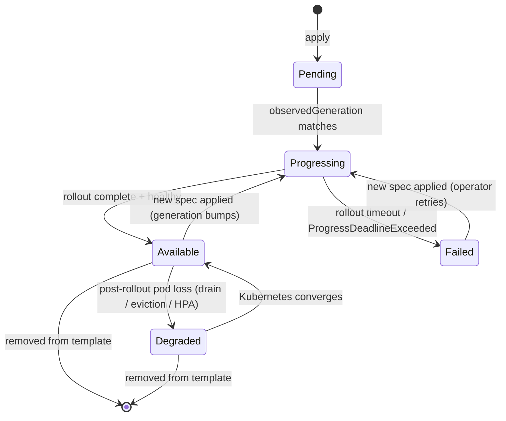

# Resource Phases

Each child resource that a LynqNode manages is classified into exactly one of **five phases** every reconcile. The phase model lets Lynq distinguish:

- **Rollout in progress** — Lynq just changed the spec. Lynq IS responsible for verifying convergence. Strict readiness criteria + rollout timeout still apply.
- **Steady-state pod-level disruption** — the spec hasn't changed. Kubernetes is converging the workload (node drain, HPA scale-up, pod eviction, image GC, kubelet restart). Lynq does **NOT** attribute failure.

This page is the canonical reference for the phase classifier, the per-resource status it produces, the metrics it emits, and the events it fires.

## Why phases?

Before phases, the readiness checker used strict equality (`updatedReplicas == replicas && availableReplicas == replicas`) for every kind of pod-based workload. Combined with the rollout timeout (`lynq.sh/apply-start-time`, reset only on spec change), this meant:

- A Deployment that was Ready hours ago and lost one pod to a node drain *today* hit `ReadinessTimeout` → `failedResources++` → LynqNode flipped `Degraded`, even though `Deployment.status.conditions[Available]=True`.
- HPA scale-ups that briefly outpaced pod readiness reported failures.
- Kubelet restarts that briefly evicted pods reported failures.

Kubernetes itself has clear semantics for the rollout-vs-steady-state boundary. The phase model just adopts them.

## The 5 phases

| Phase | Condition | LynqNode treatment |
|-------|-----------|--------------------|
| `Pending` | `observedGeneration < generation`, or `spec.replicas==0`, or controller hasn't observed the spec yet | Blocks dependents silently |
| `Progressing` | observedGeneration matches but rollout criteria not yet met | Blocks dependents silently. Subject to **rollout timeout** (`lynq.sh/apply-start-time` mechanism). |
| `Available` | rollout complete AND fully healthy by native K8s semantics | Counts toward `readyResources` |
| `Degraded` | rollout completed for current generation BUT availability dropped post-rollout | Counts toward `readyResources` AND `degradedResources`. **Never transitions to `Failed`** — no steady-state timeout. |
| `Failed` | rollout timeout exceeded while Progressing, OR `Deployment.conditions[Progressing].reason=ProgressDeadlineExceeded`, OR apply error, OR `Job.conditions[Failed]=True` | Counts toward `failedResources` |

`Available` and `Degraded` both contribute to `readyResources` — a Deployment with 2 of 3 pods serving traffic is still considered Ready for LynqNode aggregation. The `degradedResources` count and the dedicated `Degraded` condition with reason `ResourcesDegraded` surface the steady-state disruption separately.

## State diagram



Transitions are observed against `node.status.resourcePhases` (the previous reconcile's phase per resource ID). Restart behavior is consistent: a resource that was already `Degraded` at controller restart does NOT re-emit `WorkloadDegraded` because there is no transition.

## Per-kind classification

The classifier is a pure function of the live child object's status fields plus `elapsedSinceApply` (from `lynq.sh/apply-start-time`). No annotations are written for classification — preserves the "exactly one API write per reconcile" invariant.

### Deployment

```
Pending      observedGeneration < generation, or spec.replicas == 0
Progressing  observedGeneration == generation AND updatedReplicas < spec.replicas
Available    observedGeneration == generation AND updatedReplicas == spec.replicas
             AND availableReplicas == spec.replicas
Degraded     observedGeneration == generation AND updatedReplicas == spec.replicas
             AND availableReplicas < spec.replicas  ← post-rollout disruption
Failed       status.conditions[Progressing].reason == "ProgressDeadlineExceeded"
             OR rollout timeout elapsed while Progressing
```

The canonical "rollout complete" signal is `updatedReplicas == spec.replicas`. Once the new ReplicaSet has fully rolled out, subsequent drops in `availableReplicas` are steady-state disruption.

### StatefulSet

```
Available    observedGeneration == generation AND updatedReplicas == spec.replicas
             AND currentReplicas == spec.replicas
             AND (updateRevision == "" OR currentRevision == updateRevision)
             AND readyReplicas == spec.replicas
Degraded     (above rollout-complete criteria) AND readyReplicas < spec.replicas
```

`currentRevision == updateRevision` is the StatefulSet-specific "rollout complete" signal.

### DaemonSet

```
Available    observedGeneration == generation
             AND updatedNumberScheduled == desiredNumberScheduled
             AND numberAvailable == desiredNumberScheduled
Degraded     updatedNumberScheduled == desiredNumberScheduled
             AND numberAvailable < desiredNumberScheduled  ← e.g., node drain
```

### Everything else

`Service`, `ConfigMap`, `Secret`, `ServiceAccount`, `CronJob`, `PodDisruptionBudget`, `NetworkPolicy`, `Ingress`, `PVC`, `HPA`, `Job`, custom resources — these don't have the post-rollout-partial-availability concept. They classify as `Available` or `Pending`/`Progressing`/`Failed` per their native readiness signals (same conditions as the legacy `IsReady` check). They do NOT have a `Degraded` phase.

## Per-resource visibility

The per-resource phase array is the source of truth for kubectl jsonpath and custom-columns queries:

```yaml
status:
  resourcePhases:
  - id: app-deployment
    kind: Deployment
    name: acme-prod-web
    phase: Degraded
    reason: "availableReplicas=2/3, observedGeneration matched"
    sinceSeconds: 47
  - id: app-service
    kind: Service
    name: acme-prod-web
    phase: Available
```

Quick recipes:

```bash
# Default view — Degraded and Progressing columns surface immediately
kubectl get lynqnode

# Wide view exposes Failed, Skipped, Pending, Conflicted, DegradedIds
kubectl get lynqnode -o wide

# Per-resource phase via custom-columns
kubectl get lynqnode acme-corp-web-app -o custom-columns=\
'NAME:.metadata.name,RESOURCE:.status.resourcePhases[*].id,PHASE:.status.resourcePhases[*].phase'

# Find currently-Degraded resources across the cluster
kubectl get lynqnodes -A -o jsonpath=\
'{range .items[*]}{range .status.resourcePhases[?(@.phase=="Degraded")]}{.id}{"\t"}{.reason}{"\n"}{end}{end}'
```

## LynqNode conditions

| Condition | Status | Reasons |
|-----------|--------|---------|
| `Ready` | True when all resources are `Available` OR `Degraded` AND no failures/conflicts | `Reconciled` (True), `ResourcesFailed` / `ResourcesConflicted` / `ResourcesFailedAndConflicted` / `NotAllResourcesReady` (False) |
| `Progressing` | True during reconciliation | `Reconciling` / `ReconcileComplete` |
| `Conflicted` | True when any resource has ownership conflict | `ResourceConflict` / `NoConflict` |
| `Degraded` | True when at least one resource is Failed, Conflicted, OR in Degraded phase | `ResourceFailures` / `ResourceConflicts` / **`ResourcesDegraded`** (new) / **`ResourceFailuresAndDegraded`** (new) / `ResourceFailuresAndConflicts` / `ResourcesNotReady` / `Healthy` |

The `Degraded` condition with reason `ResourcesDegraded` is the new lower-severity signal: **LynqNode.Ready stays True**, but operators can see "Kubernetes is converging some workload disruption that isn't Lynq's fault."

## Metrics

Aggregate (per LynqNode):

```
lynqnode_resources_ready{lynqnode,namespace}        # Available + Degraded
lynqnode_resources_degraded{lynqnode,namespace}     # NEW
lynqnode_resources_progressing{lynqnode,namespace}  # NEW
lynqnode_resources_pending{lynqnode,namespace}      # NEW
lynqnode_resources_failed{lynqnode,namespace}       # narrowed semantics
```

Per-resource (stateset + replica counters):

```
lynqnode_resource_phase{lynqnode,namespace,resource_id,kind,phase}  # value=1 active, 0 others
lynqnode_resource_replicas_desired{...}
lynqnode_resource_replicas_available{...}
lynqnode_resource_replicas_ready{...}
lynqnode_resource_replicas_updated{...}
lynqnode_resource_degraded_since_seconds{...}       # seconds in Degraded; 0 otherwise
```

Transitions and rollout latency:

```
lynqnode_resource_phase_transitions_total{kind,from,to}   # counter
lynqnode_resource_rollout_duration_seconds{kind,result}    # histogram; result=complete|timeout|aborted
```

See [Prometheus Queries](prometheus-queries.md) for PromQL recipes.

## Events

| Event | Type | When |
|-------|------|------|
| `WorkloadDegraded` | Warning | Available → Degraded. Includes resource id and native status snapshot. |
| `WorkloadRecovered` | Normal | Degraded → Available |
| `RolloutComplete` | Normal | Progressing/Pending → Available. Also records `lynqnode_resource_rollout_duration_seconds{result="complete"}`. |
| `ReadinessTimeout` | Warning | Progressing → Failed (rollout timeout elapsed). Narrowed: never fires during steady-state Degraded. |
| `RolloutAborted` | Warning | Progressing → Failed (non-timeout reason: ProgressDeadlineExceeded, apply error). |

Events are emitted only on real transitions — i.e., when the previous reconcile's phase for this resource differs from the current one. No spam on every reconcile.

## What changes for operators

- `failedResources` is now stricter — no false positives from node drain.
- `degradedResources` is new — primary signal for steady-state partial availability.
- LynqNode stays `Ready=True` during steady-state degradation. Use the `Degraded` condition with reason `ResourcesDegraded` (or the metric) to alert on it.
- `ReadinessTimeout` event no longer fires during steady-state Degraded — only during active rollouts.
- New alerts: `LynqNodeWorkloadDegraded` (Warning, 15+ min), `LynqNodeWorkloadSeverelyDegraded` (Critical, single resource > 30 min), `LynqNodeWorkloadFlapping`, `LynqNodeRolloutSlow`. See [Alert Runbooks](alert-runbooks.md).

## Rollback

For emergency rollback to pre-phase-model behavior, set the controller flag:

```
--legacy-readiness-strict=true
```

Strict equality returns, `Degraded` phase is never observed, `WorkloadDegraded` events are never emitted, `ReadinessTimeout` fires on any partial availability past `timeoutSeconds`. The new metric series remain registered but the gauges stay at 0. This flag is slated for removal after one release cycle.

## See also

- [Architecture](architecture.md) — where the phase model fits in the reconcile pipeline
- [LynqNode API](api-lynqnode.md) — status field reference
- [Monitoring](monitoring.md) — metric and event catalog
- [Prometheus Queries](prometheus-queries.md) — PromQL recipes for the new metrics
- [Alert Runbooks](alert-runbooks.md) — diagnosis steps for the new alerts
- [Troubleshooting](troubleshooting.md) — diagnose "degraded but not failed" scenarios
