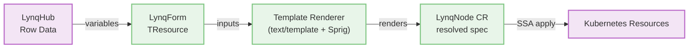

# Template Guide

Templates are the core of Lynq's resource generation system. This guide covers template syntax, available functions, and best practices.

[[toc]]

## Template Basics

Lynq uses Go's `text/template` engine with the Sprig function library, providing 200+ built-in functions.



::: v-pre

### Template Syntax

```yaml
# Basic variable substitution
nameTemplate: "{{ .uid }}-app"

# With function
nameTemplate: "{{ .uid | trunc63 }}"

# Conditional
nameTemplate: "{{ if .region }}{{ .region }}-{{ end }}{{ .uid }}"

# Default value
nameTemplate: "{{ .uid }}-{{ .planId | default \"basic\" }}"
```

:::

## Available Variables

::: v-pre

### Required Variables

These are always available from the template context:

```yaml
.uid         # Node unique identifier (from uid mapping)
.activate    # Activation status (from activate mapping)
```

:::

### Deprecated Variables

::: danger DEPRECATED
The following variables are **deprecated since v1.1.11** and will be **removed in v1.3.0**:
:::

::: v-pre

```yaml
.hostOrUrl   # Original URL/host from registry (from hostOrUrl mapping)
.host        # Auto-extracted host from .hostOrUrl
```

:::

::: tip Migration Guide
**Instead of using `.hostOrUrl` and `.host`:**

**Before (deprecated):**

::: v-pre

```yaml
# In LynqHub
spec:
  valueMappings:
    uid: node_id
    hostOrUrl: domain_url  # ⚠️ Deprecated
    activate: is_active

# In template
env:
  - name: HOST
    value: "{{ .host }}"  # ⚠️ Deprecated
```

:::

**After (v1.1.11+):**

::: v-pre

```yaml
# In LynqHub
spec:
  valueMappings:
    uid: node_id
    activate: is_active
  extraValueMappings:
    domainUrl: domain_url  # ✅ Use extraValueMappings

# In template
env:
  - name: HOST
    value: "{{ .domainUrl | toHost }}"  # ✅ Use toHost() function
```

:::

**Why this change?**
Lynq is now a **database-driven automation platform**, not limited to tenant/host provisioning. Requiring `.hostOrUrl` was an unnecessary constraint from the legacy "tenant-operator" design.

::: v-pre

### Context Variables

Automatically provided:

```yaml
.hubId   # LynqHub name
.templateRef  # LynqForm name
```

### Custom Variables

From `extraValueMappings` in LynqHub:

```yaml
spec:
  extraValueMappings:
    planId: subscription_plan
    region: deployment_region
    dbHost: database_host
```

Access in templates:
```yaml
.planId   # Maps to subscription_plan column
.region   # Maps to deployment_region column
.dbHost   # Maps to database_host column
```

:::

::: v-pre

## Template Functions

### Built-in Custom Functions

#### `toHost(url)` ✅
Extract hostname from URL:

::: tip Recommended Usage
Use with `extraValueMappings` instead of deprecated `.hostOrUrl`:
```yaml
# Input: https://acme.example.com:8080/path
# Output: acme.example.com
env:
- name: HOST
  value: "{{ .domainUrl | toHost }}"  # ✅ Recommended (v1.1.11+)
  # value: "{{ .hostOrUrl | toHost }}"  # ⚠️ Deprecated, removed in v1.3.0
```
:::

#### `trunc63(s)` ✅
Truncate to 63 characters (Kubernetes name limit):
```yaml
# Ensures name fits K8s limits
nameTemplate: "{{ .uid }}-{{ .region }}-deployment | trunc63 }}"
```

#### `sha1sum(s)` ✅
Generate SHA1 hash:
```yaml
# Create unique, stable resource names
nameTemplate: "app-{{ .uid | sha1sum | trunc 8 }}"
```

#### `fromJson(s)` ✅
Parse JSON string:
```yaml
# Parse JSON configuration from database
env:
- name: API_KEY
  value: "{{ (.config | fromJson).apiKey }}"
- name: ENDPOINT
  value: "{{ (.config | fromJson).endpoint }}"
```

### Type Conversion Functions <Badge type="tip" text="^1.1.15" />

::: tip New in v1.1.15
Type conversion functions solve the **YAML quoting problem**, enabling proper type conversion for Kubernetes resource fields.
:::

#### The YAML Quoting Problem

When writing LynqForm CRDs in YAML, template expressions **must** be quoted due to YAML parser requirements:

```yaml
# ❌ INVALID YAML - Parser error
containerPort: {{ .appPort }}

# ✅ VALID YAML - Must quote template expressions
containerPort: "{{ .appPort }}"
```

**The problem:** While quotes make the YAML valid, the rendered output remains a **quoted string**, causing Kubernetes API validation to fail for numeric/boolean fields:

```yaml
# After template rendering (without type functions)
containerPort: "8080"  # ❌ String - Kubernetes API rejects
replicas: "3"          # ❌ String - Expected integer
enabled: "true"        # ❌ String - Expected boolean

# Expected by Kubernetes
containerPort: 8080    # ✅ Integer
replicas: 3            # ✅ Integer
enabled: true          # ✅ Boolean
```

#### Type Conversion Functions

::: v-pre

#### `toInt(value)`
Convert value to integer (int):

```yaml
# Basic conversion
replicas: "{{ .maxReplicas | toInt }}"          # "3" → 3
containerPort: "{{ .appPort | toInt }}"         # "8080" → 8080

# With default value
replicas: "{{ .replicas | default \"2\" | toInt }}"  # Ensures integer output

# From float (truncates)
value: "{{ .cpuCount | toInt }}"                # 2.8 → 2
```

**Conversion rules:**
- String → int: `"123"` → `123`
- Float → int: `2.8` → `2` (truncates)
- Already int: Returns as-is
- Invalid input: Returns `0` (graceful fallback)

#### `toFloat(value)`
Convert value to floating-point number (float64):

```yaml
# Resource limits with decimals
resources:
  limits:
    cpu: "{{ .cpuLimit | toFloat }}"            # "1.5" → 1.5
    memory: "{{ .memoryGb | toFloat }}Gi"       # "2.5" → "2.5Gi"

# Percentage calculations
targetCPUUtilization: "{{ .threshold | toFloat }}"  # "75.5" → 75.5
```

**Conversion rules:**
- String → float: `"1.5"` → `1.5`
- Int → float: `2` → `2.0`
- Already float: Returns as-is
- Invalid input: Returns `0.0`

#### `toBool(value)`
Convert value to boolean:

```yaml
# Feature flags
enabled: "{{ .featureEnabled | toBool }}"       # "true" → true
readOnly: "{{ .isReadOnly | toBool }}"          # "false" → false

# From integers (common in databases)
automountServiceAccountToken: "{{ .autoMount | toBool }}"  # 1 → true, 0 → false
```

**Truthy values** (converted to `true`):
- Strings: `"true"`, `"True"`, `"TRUE"`, `"1"`, `"yes"`, `"Yes"`, `"YES"`, `"y"`, `"Y"`
- Numbers: Any non-zero integer (`1`, `42`, `-5`)
- Boolean: `true`

**Falsy values** (converted to `false`):
- Strings: `"false"`, `"False"`, `"FALSE"`, `"0"`, `"no"`, `"No"`, `"NO"`, `"n"`, `"N"`, `""` (empty)
- Numbers: `0`
- Boolean: `false`

:::

#### Complete Example

::: v-pre

```yaml
apiVersion: lynq.sh/v1
kind: LynqForm
metadata:
  name: typed-app
spec:
  hubId: production-db
  deployments:
    - id: app
      nameTemplate: "{{ .uid }}-api"
      spec:
        apiVersion: apps/v1
        kind: Deployment
        spec:
          # Integer field - type conversion required
          replicas: "{{ .maxReplicas | default \"2\" | toInt }}"
          template:
            spec:
              # Boolean field - type conversion required
              automountServiceAccountToken: "{{ .mountToken | toBool }}"
              containers:
                - name: app
                  image: "{{ .image }}"
                  ports:
                    # Integer field - type conversion required
                    - containerPort: "{{ .appPort | toInt }}"
                      protocol: TCP
                  env:
                    # String fields - no conversion needed
                    - name: APP_ENV
                      value: "{{ .environment }}"
                    - name: TENANT_ID
                      value: "{{ .uid }}"
                    # Integer env var - stays as string (env values are always strings)
                    - name: MAX_CONNECTIONS
                      value: "{{ .maxConns }}"
                  resources:
                    limits:
                      # Float field - type conversion required
                      cpu: "{{ .cpuLimit | toFloat }}"
                      memory: "{{ .memoryLimit }}Mi"
                    requests:
                      cpu: "{{ .cpuRequest | toFloat }}"
                      memory: "{{ .memoryRequest }}Mi"
```

:::

#### When to Use Type Conversion

::: tip Guidelines

**✅ Use type conversion for:**
- Kubernetes resource fields expecting numbers: `replicas`, `containerPort`, `targetPort`
- Boolean fields: `automountServiceAccountToken`, `readOnlyRootFilesystem`, `privileged`
- Numeric resource limits: `cpu`, `memory` (when using float values)
- HPA/VPA metrics: `targetCPUUtilizationPercentage`, `minReplicas`, `maxReplicas`

**❌ Don't use type conversion for:**
- Environment variable values (always strings in containers)
- Labels and annotations (always strings)
- Command arguments (always strings)
- ConfigMap/Secret data values (always strings)
- Image tags (always strings, even if numeric like `"1.2.3"`)

:::

#### How It Works (Technical Details)

The hybrid approach uses **type markers** internally:

1. **Template function wraps result with marker:**
   ```go
   toInt("42") → "__LYNQ_TYPE_INT__42"  // Internal representation
   ```

2. **Go template engine processes normally:**
   - Template rendering treats marker as string
   - Marker survives template evaluation

3. **Controller automatically restores type:**
   ```go
   renderUnstructured() detects marker → converts to int → 42
   ```

4. **Kubernetes receives correctly-typed value:**
   ```yaml
   containerPort: 42  # Pure integer, no quotes
   ```

::: details Why not use Sprig's `atoi`?
Go's `text/template` engine always returns rendered results as **strings**, regardless of function return types. Sprig's `atoi` returns an integer *during* template execution, but the final output is still a string.

The type marker approach is the only way to preserve type information across the template rendering boundary.
:::

### Sprig Functions (200+)

Full documentation: https://masterminds.github.io/sprig/

#### String Functions

```yaml
# Uppercase/lowercase
nameTemplate: "{{ .uid | upper }}"
nameTemplate: "{{ .uid | lower }}"

# Trim whitespace
value: "{{ .name | trim }}"

# Replace
value: "{{ .uid | replace \".\" \"-\" }}"

# Quote
value: "{{ .name | quote }}"
```

#### Encoding Functions

```yaml
# Base64 encode/decode
value: "{{ .secret | b64enc }}"
value: "{{ .encoded | b64dec }}"

# URL encoding
value: "{{ .param | urlquery }}"

# SHA256
value: "{{ .data | sha256sum }}"
```

#### Default Values

```yaml
# Provide default if variable is empty
image: "{{ .deployImage | default \"nginx:stable\" }}"
port: "{{ .appPort | default \"8080\" }}"
region: "{{ .region | default \"us-east-1\" }}"
```

#### Conditionals

```yaml
# If/else
env:
- name: DEBUG
  value: "{{ if eq .planId \"enterprise\" }}true{{ else }}false{{ end }}"

# Ternary
replicas: {{ ternary 5 2 (eq .planId "enterprise") }}
```

#### Lists and Iteration

```yaml
# Join
annotations:
  tags: "{{ list \"app\" .uid .region | join \",\" }}"

# Iterate (in ConfigMap data)
data:
  config.json: |
    {
      "tenants": [
        {{- range $i, $id := list \"tenant1\" \"tenant2\" }}
        {{ if $i }},{{ end }}
        "{{ $id }}"
        {{- end }}
      ]
    }
```

#### Math Functions

```yaml
# Arithmetic
value: "{{ add .basePort 1000 }}"
value: "{{ mul .cpuLimit 2 }}"

# Min/max
value: "{{ max .minReplicas 3 }}"
```

## Template Examples

::: v-pre

### Example 1: Multi-Region Deployment with Type Conversion

```yaml
deployments:
  - id: app
    nameTemplate: "{{ .uid }}-{{ .region | default \"default\" }}"
    spec:
      apiVersion: apps/v1
      kind: Deployment
      spec:
        # Integer field - use toInt for conditional numeric values
        replicas: "{{ if eq .planId \"enterprise\" }}5{{ else }}2{{ end | toInt }}"
        template:
          spec:
            # Boolean field - use toBool
            automountServiceAccountToken: "{{ .autoMount | default \"true\" | toBool }}"
            containers:
            - name: app
              image: "{{ .deployImage | default \"myapp:latest\" }}"
              ports:
              - containerPort: "{{ .appPort | default \"8080\" | toInt }}"
                protocol: TCP
              env:
              - name: TENANT_ID
                value: "{{ .uid }}"
              - name: REGION
                value: "{{ .region | default \"us-east-1\" }}"
              - name: DATABASE_HOST
                value: "{{ .dbHost }}"
              resources:
                limits:
                  cpu: "{{ .cpuLimit | default \"1.0\" | toFloat }}"
                  memory: "{{ .memoryLimit | default \"512\" }}Mi"
                requests:
                  cpu: "{{ .cpuRequest | default \"0.5\" | toFloat }}"
                  memory: "{{ .memoryRequest | default \"256\" }}Mi"
```

### Example 2: Secure Resource Names

```yaml
# Use SHA1 to create short, unique, stable names
nameTemplate: "{{ .uid | sha1sum | trunc 8 }}-app"

# Ensures:
# - Fixed length (8 chars + "-app")
# - Unique per node
# - Stable across reconciliations
# - URL-safe
```

### Example 3: JSON Configuration

Database column contains JSON:
```json
{
  "apiKey": "sk-abc123",
  "features": ["feature-a", "feature-b"],
  "limits": {"requests": 1000}
}
```

Template usage:
```yaml
env:
- name: API_KEY
  value: "{{ (.config | fromJson).apiKey }}"
- name: RATE_LIMIT
  value: "{{ (.config | fromJson).limits.requests }}"
```

### Example 4: Conditional Resources

```yaml
# Only create Redis for premium plans
{{- if or (eq .planId "premium") (eq .planId "enterprise") }}
deployments:
  - id: redis
    nameTemplate: "{{ .uid }}-redis"
    spec:
      apiVersion: apps/v1
      kind: Deployment
      spec:
        replicas: 1
        template:
          spec:
            containers:
            - name: redis
              image: redis:7-alpine
{{- end }}
```

### Example 5: Dynamic Labels

```yaml
labelsTemplate:
  app: "{{ .uid }}"
  node: "{{ .uid }}"
  plan: "{{ .planId | default \"basic\" }}"
  region: "{{ .region | default \"global\" }}"
  managed-by: "lynq"
  version: "{{ .appVersion | default \"v1.0.0\" }}"
```

:::

## Template Best Practices

::: v-pre

### 1. Use Default Values

Always provide defaults for optional variables:

```yaml
# Good
image: "{{ .deployImage | default \"nginx:stable\" }}"

# Bad (fails if deployImage is empty)
image: "{{ .deployImage }}"
```

### 2. Respect Kubernetes Naming Limits

Always truncate names that might exceed 63 characters:

```yaml
# Good
nameTemplate: "{{ .uid }}-{{ .region }}-deployment | trunc63 }}"

# Bad (can exceed 63 chars)
nameTemplate: "{{ .uid }}-{{ .region }}-deployment"
```

### 3. Quote String Values in YAML

```yaml
# Good
value: "{{ .uid }}"

# Bad (can cause YAML parsing errors)
value: {{ .uid }}
```

### 4. Use Type Conversion for Kubernetes Fields

Always use type conversion functions for fields expecting numbers or booleans:

```yaml
# Good - Kubernetes receives correct types
replicas: "{{ .maxReplicas | toInt }}"
containerPort: "{{ .appPort | toInt }}"
automountServiceAccountToken: "{{ .autoMount | toBool }}"

# Bad - Kubernetes API validation fails
replicas: "{{ .maxReplicas }}"        # String "3" instead of 3
containerPort: "{{ .appPort }}"       # String "8080" instead of 8080
```

**Common fields requiring type conversion:**
- **Integers**: `replicas`, `containerPort`, `targetPort`, `minReplicas`, `maxReplicas`
- **Floats**: `cpu` (resource limits), `targetCPUUtilizationPercentage`
- **Booleans**: `automountServiceAccountToken`, `readOnlyRootFilesystem`, `privileged`

**Exception:** Environment variables are always strings, don't convert:
```yaml
# Good - env values are always strings
env:
  - name: PORT
    value: "{{ .appPort }}"  # Keep as string

# Unnecessary
env:
  - name: PORT
    value: "{{ .appPort | toInt }}"  # Don't convert
```

### 5. Handle Missing Variables Gracefully

```yaml
# Good - provides default and checks existence
{{- if .optionalField }}
value: "{{ .optionalField }}"
{{- else }}
value: "default-value"
{{- end }}

# Or simpler
value: "{{ .optionalField | default \"default-value\" }}"
```

### 6. Combine Type Conversion with Default Values

Chain type conversion after default values to ensure proper types:

```yaml
# Good - provides default then converts type
replicas: "{{ .replicas | default \"2\" | toInt }}"
cpu: "{{ .cpuLimit | default \"1.0\" | toFloat }}"
enabled: "{{ .feature | default \"true\" | toBool }}"

# Bad - type conversion on potentially empty value
replicas: "{{ .replicas | toInt }}"  # May fail if .replicas is empty
```

### 7. Use Comments for Complex Logic

```yaml
# Calculate replicas based on plan tier
# enterprise: 5, premium: 3, basic: 2
replicas: {{- if eq .planId "enterprise" }}5{{- else if eq .planId "premium" }}3{{- else }}2{{- end }}
```

:::

## Template Rendering Process

::: v-pre

### 1. Variable Collection

Hub controller collects variables from database row:
```
uid = "acme-corp"
# hostOrUrl = "https://acme.example.com"  # DEPRECATED v1.1.11+
activate = true
planId = "enterprise"
customUrl = "https://acme.example.com"  # Use extraValueMappings instead
```

### 2. Auto-Processing (Deprecated)

**Note:** This step is deprecated since v1.1.11.

~~Operator automatically extracts `.host`:~~
```
# .host = "acme.example.com"  # DEPRECATED - extracted from .hostOrUrl
```

**New approach (v1.1.11+):** Use `toHost()` function in templates:
```
# In template:
value: "{{ .customUrl | toHost }}"  # Extracts "acme.example.com"
```

### 3. Template Evaluation

For each resource in the template:
- Render `nameTemplate` → resource name
- Render `labelsTemplate` → labels
- Render `annotationsTemplate` → annotations
- Render `spec` → recursively render all string values in the resource

### 4. Resource Creation

Rendered resource is applied to Kubernetes using Server-Side Apply.

## Debugging Templates

### Preview Template Rendering (Before Applying)

Test your templates locally before deploying to the cluster:

**Method 1: Using `kubectl --dry-run` with test LynqNode**

```bash
# Create a test LynqNode manifest with sample data
cat <<EOF > test-lynqnode.yaml
apiVersion: lynq.sh/v1
kind: LynqNode
metadata:
  name: test-node
  namespace: lynq-system
  annotations:
    lynq.sh/uid: "acme-corp"
    lynq.sh/planType: "enterprise"
    lynq.sh/region: "us-east-1"
spec:
  hubId: customer-hub
  templateRef: customer-web-app
EOF

# Dry-run apply to see validation errors
kubectl apply -f test-lynqnode.yaml --dry-run=server -o yaml
```

**Method 2: Check rendered resources in existing LynqNode**

```bash
# View the fully rendered deployment spec
$ kubectl get lynqnode acme-corp-customer-web-app -n lynq-system \
    -o jsonpath='{.spec.deployments[0]}' | jq .

# Expected output (template already evaluated):
{
  "id": "web-deployment",
  "nameTemplate": "acme-corp-web",  # ← Rendered from "{{ .uid }}-web"
  "spec": {
    "replicas": 3,                   # ← Rendered from conditional (enterprise plan)
    "selector": {
      "matchLabels": {
        "app": "acme-corp-web",      # ← Rendered from "{{ .uid }}-web"
        "customer": "acme-corp"
      }
    }
    # ... rest of rendered spec
  }
}
```

**Method 3: Simulate template rendering with Go**

For advanced debugging, create a test script:

```go
// test_template.go
package main

import (
    "os"
    "text/template"
    "github.com/Masterminds/sprig/v3"
)

func main() {
    tmpl := `{{ .uid }}-{{ .planType | default "basic" }}`

    t := template.Must(template.New("test").Funcs(sprig.TxtFuncMap()).Parse(tmpl))
    t.Execute(os.Stdout, map[string]string{
        "uid":      "acme-corp",
        "planType": "enterprise",
    })
    // Output: acme-corp-enterprise
}
```

### Check Rendered Values

View rendered LynqNode CR to see evaluated templates:

```bash
# Get full LynqNode CR
$ kubectl get lynqnode acme-corp-customer-web-app -n lynq-system -o yaml

# Output includes rendered values:
apiVersion: lynq.sh/v1
kind: LynqNode
metadata:
  name: acme-corp-customer-web-app
  annotations:
    lynq.sh/uid: "acme-corp"
    lynq.sh/planType: "enterprise"
spec:
  deployments:
    - id: web-deployment
      nameTemplate: "acme-corp-web"  # ← Already rendered
      spec:
        replicas: 3                   # ← Type correctly converted
# ...

# Check specific rendered field
$ kubectl get lynqnode acme-corp-customer-web-app -n lynq-system \
    -o jsonpath='{.spec.deployments[0].spec.replicas}'
3  # ← Correctly rendered as integer (not "3")
```

### Watch for Rendering Errors

```bash
# Check operator logs for render errors
$ kubectl logs -n lynq-system deployment/lynq-controller-manager -f | grep -E "(render|template|error)"

# Example: Successful rendering
2025-01-15T10:30:00Z INFO  controller.lynqnode  Rendered template successfully  {"lynqnode": "acme-corp-customer-web-app", "resources": 3}

# Example: Template error
2025-01-15T10:30:00Z ERROR controller.lynqnode  Template rendering failed  {"lynqnode": "test-node", "error": "template: tmpl:1: function \"unknownFunc\" not defined"}

# Check LynqNode events for errors
$ kubectl describe lynqnode acme-corp-customer-web-app -n lynq-system
Events:
  Type     Reason                Age   Message
  ----     ------                ----  -------
  Normal   TemplateRendered      5m    Successfully rendered 3 resources
  Normal   ResourceApplied       5m    Applied Deployment/acme-corp-web
  Normal   ResourceApplied       5m    Applied Service/acme-corp-web-svc
  Normal   Ready                 5m    All resources are ready
```

### Debugging Decision Tree

```
Template not working?
│
├─ YAML parse error?
│  └─ Check: Are template expressions quoted? "{{ .value }}"
│
├─ Function not defined?
│  └─ Check: Sprig docs or custom functions (toHost, sha1sum, etc.)
│
├─ Variable not found?
│  └─ Check: Is it in valueMappings or extraValueMappings?
│
├─ Type error (string vs int)?
│  └─ Check: Are you using toInt/toFloat/toBool for K8s fields?
│
├─ Resource not created?
│  └─ Check: LynqNode events and operator logs
│
└─ Resource in wrong state?
   └─ Check: Dependencies satisfied? Policies correct?
```

### Common Errors

**Error:** `template: tmpl:1: function "unknownFunc" not defined`
- **Cause:** Using a function that doesn't exist
- **Fix:** Check [Sprig docs](https://masterminds.github.io/sprig/) or [Custom Functions](#built-in-custom-functions)

**Error:** `template: tmpl:1:10: executing "tmpl" at <.missingVar>: map has no entry for key "missingVar"`
- **Cause:** Referencing a variable that doesn't exist
- **Fix:** Use `default` function or check `extraValueMappings`

**Error:** `yaml: line 10: mapping values are not allowed in this context`
- **Cause:** Missing quotes around template
- **Fix:** Always quote templates: `"{{ .value }}"`

**Error:** `admission webhook denied: spec.replicas: Invalid value: "string": spec.replicas in body must be of type integer`
- **Cause:** Kubernetes field received string instead of number
- **Fix:** Use type conversion function:
  ```yaml
  # Before (error)
  replicas: "{{ .maxReplicas }}"  # Renders as string "3"

  # After (correct)
  replicas: "{{ .maxReplicas | toInt }}"  # Renders as integer 3
  ```

**Error:** `json: cannot unmarshal string into Go struct field ... of type int32`
- **Cause:** Integer field received quoted string value
- **Fix:** Use `toInt` for integer fields:
  ```yaml
  containerPort: "{{ .port | toInt }}"        # int/int32
  replicas: "{{ .replicas | toInt }}"         # int32
  ```

**Error:** `json: cannot unmarshal string into Go struct field ... of type bool`
- **Cause:** Boolean field received string value
- **Fix:** Use `toBool` for boolean fields:
  ```yaml
  automountServiceAccountToken: "{{ .autoMount | toBool }}"
  readOnlyRootFilesystem: "{{ .readOnly | toBool }}"
  ```

## Advanced Template Techniques

### Nested Templates

```yaml
# Define reusable template values
{{- $appName := printf "%s-app" .uid }}

nameTemplate: "{{ $appName }}"
```

#### Complex Nested Template Scenario

When building multi-tier applications, nested templates help avoid repetition:

```yaml
apiVersion: lynq.sh/v1
kind: LynqForm
metadata:
  name: multi-tier-app
spec:
  hubId: customer-hub
  deployments:
    - id: web
      nameTemplate: |
        {{- $base := printf "%s-%s" .uid (.region | default "default") -}}
        {{ $base | trunc63 }}-web
      spec:
        apiVersion: apps/v1
        kind: Deployment
        metadata:
          labels:
            {{- $tier := "frontend" }}
            {{- $version := .appVersion | default "v1.0.0" }}
            app.kubernetes.io/name: "{{ .uid }}"
            app.kubernetes.io/component: "{{ $tier }}"
            app.kubernetes.io/version: "{{ $version }}"
        spec:
          replicas: "{{ .webReplicas | default \"2\" | toInt }}"
          template:
            spec:
              containers:
                - name: web
                  image: "{{ .webImage | default \"nginx:stable\" }}"
                  env:
                    {{- $apiHost := printf "%s-api-svc.%s.svc.cluster.local" .uid .namespace }}
                    - name: API_ENDPOINT
                      value: "http://{{ $apiHost }}"
                    - name: CUSTOMER_ID
                      value: "{{ .uid }}"
    - id: api
      nameTemplate: |
        {{- $base := printf "%s-%s" .uid (.region | default "default") -}}
        {{ $base | trunc63 }}-api
      dependIds: [web]
      spec:
        apiVersion: apps/v1
        kind: Deployment
        metadata:
          labels:
            {{- $tier := "backend" }}
            app.kubernetes.io/name: "{{ .uid }}"
            app.kubernetes.io/component: "{{ $tier }}"
        spec:
          replicas: "{{ .apiReplicas | default \"3\" | toInt }}"
          template:
            spec:
              containers:
                - name: api
                  image: "{{ .apiImage | default \"api:latest\" }}"
                  env:
                    {{- $dbHost := printf "%s-db.%s.svc.cluster.local" .uid .namespace }}
                    - name: DATABASE_URL
                      value: "postgres://{{ $dbHost }}:5432/{{ .uid }}"
```

**Key patterns demonstrated:**
- `$base` variable reused across multiple templates
- `$tier` scoped within each deployment block
- `$apiHost` and `$dbHost` computed from other variables
- Service discovery URLs constructed dynamically

#### When to Use Nested Templates

| Scenario | Use Nested Templates? | Example |
|----------|----------------------|---------|
| Same prefix for multiple resources | ✅ Yes | `$base := printf "%s-%s" .uid .region` |
| Computed service discovery URLs | ✅ Yes | `$apiHost := printf "%s-api.%s.svc" .uid .namespace` |
| Simple variable substitution | ❌ No | Just use `{{ .uid }}` directly |
| Complex conditional logic | ✅ Yes | `$tier := ternary "prod" "dev" .isProduction` |
| One-time value transformation | ❌ No | Use inline: `{{ .uid | upper }}` |

### Range Over Lists

```yaml
# In ConfigMap data field
data:
  endpoints.txt: |
    {{- range $i, $region := list "us-east-1" "us-west-2" "eu-west-1" }}
    {{ $region }}.example.com
    {{- end }}
```

### Complex JSON Parsing

```yaml
# Database field: config = '{"db":{"host":"localhost","port":5432}}'
env:
- name: DB_HOST
  value: "{{ ((.config | fromJson).db).host }}"
- name: DB_PORT
  value: "{{ ((.config | fromJson).db).port }}"
```

:::

## Template Evolution

::: tip Dynamic Updates
LynqForms can be safely modified at runtime. The operator automatically handles resource additions, modifications, and removals.
:::

::: v-pre

### Adding Resources

New resources are automatically created during the next reconciliation:

```yaml
# Add a new service to existing template
services:
  - id: api-service
    nameTemplate: "{{ .uid }}-api"
    spec:
      apiVersion: v1
      kind: Service
      # ... service spec
```

**Result:** Service is created for all existing LynqNodes using this template.

### Modifying Resources

Existing resources are updated according to their `patchStrategy`:

```yaml
deployments:
  - id: web
    patchStrategy: apply  # SSA updates managed fields only
    spec:
      # Modified spec here
```

**Result:** Resources are updated while preserving unmanaged fields.

### Removing Resources

::: warning Orphan Cleanup
Removed resources are automatically deleted or retained based on their `deletionPolicy`.
:::

**Example:**

```yaml
# Before: Template has 3 deployments
deployments:
  - id: web
    deletionPolicy: Delete
  - id: worker
    deletionPolicy: Retain
  - id: cache
    deletionPolicy: Delete

# After: Removed worker and cache
deployments:
  - id: web
    deletionPolicy: Delete
```

**Result:**
- `worker` deployment: **Retained** in cluster with orphan labels (no ownerReference was set initially)
- `cache` deployment: **Deleted** from cluster (via ownerReference)
- `web` deployment: Continues to be managed normally

**Orphan markers added to retained resources:**

```yaml
metadata:
  labels:
    lynq.sh/orphaned: "true"  # Label for selector queries
  annotations:
    lynq.sh/orphaned-at: "2025-01-15T10:30:00Z"  # RFC3339 timestamp
    lynq.sh/orphaned-reason: "RemovedFromTemplate"
```

**Why label + annotation?**
- Label values must be RFC 1123 compliant (no colons), so we use simple `"true"` for selectors
- Annotations can store detailed metadata like timestamps without format restrictions

**Re-adoption of Orphaned Resources:**

When you re-add a previously removed resource back to the template:
- Operator automatically detects and removes all orphan markers
- Resource smoothly transitions back to managed state
- No manual intervention needed

This enables safe experimentation:
```yaml
# Day 1: Remove worker deployment
deployments:
  - id: web  # worker removed

# Day 2: Re-add worker deployment
deployments:
  - id: web
  - id: worker  # Re-added! Orphan markers auto-removed
```

**Concrete Example: Before and After Re-adoption**

```bash
# Step 1: Check the orphaned resource
$ kubectl get deployment acme-worker -o yaml
```

```yaml
# BEFORE: Orphaned state (worker was removed from template)
apiVersion: apps/v1
kind: Deployment
metadata:
  name: acme-worker
  namespace: lynq-system
  labels:
    lynq.sh/orphaned: "true"              # ← Orphan marker (label)
    app: acme-worker
  annotations:
    lynq.sh/orphaned-at: "2025-01-15T10:30:00Z"           # ← Timestamp
    lynq.sh/orphaned-reason: "RemovedFromTemplate"        # ← Reason
    lynq.sh/deletion-policy: "Retain"                      # ← Original policy
  # Note: NO ownerReferences (removed during orphaning)
spec:
  replicas: 2
  # ... rest of spec
```

```yaml
# AFTER: Re-adopted (worker added back to template)
apiVersion: apps/v1
kind: Deployment
metadata:
  name: acme-worker
  namespace: lynq-system
  labels:
    lynq.sh/node: "acme-customer-web-app"         # ← Tracking restored
    lynq.sh/node-namespace: "lynq-system"
    app: acme-worker
    # lynq.sh/orphaned label REMOVED
  annotations:
    lynq.sh/deletion-policy: "Retain"
    # orphaned-at and orphaned-reason annotations REMOVED
  ownerReferences:                                 # ← OwnerRef restored
    - apiVersion: lynq.sh/v1
      kind: LynqNode
      name: acme-customer-web-app
      uid: abc123-456
spec:
  replicas: 2
  # ... rest of spec (may be updated by template)
```

**Verify re-adoption:**
```bash
# Confirm orphan markers are removed
$ kubectl get deployment acme-worker -o jsonpath='{.metadata.labels.lynq\.sh/orphaned}'
# (empty output = successfully re-adopted)

# Confirm tracking labels are restored
$ kubectl get deployment acme-worker -o jsonpath='{.metadata.labels.lynq\.sh/node}'
acme-customer-web-app
```

You can easily find these orphaned resources later:

```bash
# Find all orphaned resources (using label selector)
kubectl get all -A -l lynq.sh/orphaned=true

# Find resources orphaned due to template changes (filter by annotation)
kubectl get all -A -l lynq.sh/orphaned=true -o jsonpath='{range .items[?(@.metadata.annotations.k8s-lynq\.org/orphaned-reason=="RemovedFromTemplate")]}{.kind}/{.metadata.name}{"\n"}{end}'
```

**How it works:**

1. Operator tracks applied resources in `LynqNode.status.appliedResources`
2. During reconciliation, compares current template with previous state
3. Detects orphaned resources (in status but not in template)
4. Applies each resource's `deletionPolicy`:
   - `Delete`: Removes from cluster (automatic via ownerReference)
   - `Retain`: Removes tracking labels, adds orphan labels, keeps resource (no ownerReference to remove)

**Benefits:**
- ✅ Safe template evolution without manual intervention
- ✅ No accumulation of orphaned resources
- ✅ Consistent behavior across all deletion scenarios
- ✅ Automatic during normal reconciliation (no special operation needed)

### Best Practices for Template Changes

1. **Test in non-production first**: Validate template changes in dev/staging
2. **Use appropriate deletion policies**:
   - `Delete` for stateless resources (Deployments, Services)
   - `Retain` for stateful resources (PVCs, databases)
3. **Review `appliedResources` status**: Check what resources are currently tracked
4. **Monitor reconciliation**: Watch operator logs during template updates
5. **Use `creationPolicy: Once`** for resources that shouldn't be updated

**Example workflow:**

```bash
# 1. Check current applied resources
kubectl get lynqnode -o jsonpath='{.status.appliedResources}'

# 2. Update template
kubectl apply -f updated-template.yaml

# 3. Monitor reconciliation
kubectl logs -n lynq-system deployment/lynq-controller-manager -f

# 4. Verify changes
kubectl get lynqnode -o yaml
```

## See Also

- [Policies Guide](policies.md) - Creation/deletion/conflict policies
- [Dependencies Guide](dependencies.md) - Resource ordering
- [API Reference](api.md) - Complete CRD schema
