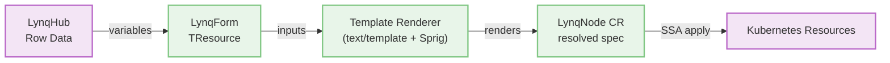

# Templates

LynqForm resource specs are Go `text/template` strings rendered at reconciliation time. Variables come from the LynqHub row; 200+ Sprig functions plus a handful of Lynq-specific helpers are available.


```mermaid
flowchart LR
    Hub["LynqHub<br/>Row Data"]
    Template["LynqForm<br/>TResource"]
    Renderer["Template Renderer<br/>(text/template + Sprig)"]
    Node["LynqNode CR<br/>resolved spec"]
    K8s["Kubernetes Resources"]

    Hub -- variables --> Template
    Template -- inputs --> Renderer
    Renderer -- renders --> Node
    Node -- SSA apply --> K8s

    classDef component fill:#e8f5e9,stroke:#81c784,stroke-width:2px;
    classDef data fill:#f3e5f5,stroke:#ba68c8,stroke-width:2px;
    class Hub data;
    class Template component;
    class Renderer component;
    class Node component;
    class K8s data;
```

## Template Syntax

::: v-pre

```yaml
# Variable substitution
nameTemplate: "{{ .uid }}-app"

# Pipeline (function applied to variable)
nameTemplate: "{{ .uid | trunc63 }}"

# Conditional
nameTemplate: "{{ if .region }}{{ .region }}-{{ end }}{{ .uid }}"

# Default value
nameTemplate: "{{ .uid }}-{{ .planId | default \"basic\" }}"
```

:::

## Examples

::: v-pre

### Deployment with Type-Safe Fields


```yaml
deployments:
  - id: app
    nameTemplate: "{{ .uid }}-{{ .region | default \"default\" }}"
    spec:
      apiVersion: apps/v1
      kind: Deployment
      spec:
        replicas: "{{ .maxReplicas | default \"2\" | int }}"
        template:
          spec:
            automountServiceAccountToken: "{{ .autoMount | default \"true\" | bool }}"
            containers:
            - name: app
              image: "{{ .deployImage | default \"myapp:latest\" }}"
              ports:
              - containerPort: "{{ .appPort | default \"8080\" | int }}"
              env:
              - name: NODE_ID
                value: "{{ .uid }}"
              - name: REGION
                value: "{{ .region | default \"us-east-1\" }}"
              resources:
                limits:
                  cpu: "{{ .cpuLimit | default \"1.0\" | float }}"
                  memory: "{{ .memoryLimit | default \"512\" }}Mi"
```

### Dynamic Labels

```yaml
labelsTemplate:
  app: "{{ .uid }}"
  plan: "{{ .planId | default \"basic\" }}"
  region: "{{ .region | default \"global\" }}"
  managed-by: "lynq"
```

### Stable Short Names

```yaml
# SHA1 hash → 8 chars → unique, stable, URL-safe
nameTemplate: "{{ .uid | sha1sum | trunc 8 }}-app"
```

### Conditional Resource Config

Use `ternary` for binary switches — it keeps template expressions readable inline:

```yaml
env:
- name: DEBUG
  value: "{{ ternary \"true\" \"false\" (eq .planId \"enterprise\") }}"
- name: REPLICAS
  value: "{{ ternary \"5\" \"2\" (eq .planId \"enterprise\") }}"
```

For multi-tier values (e.g., `enterprise`/`pro`/`basic` each getting different limits), use `extraValueMappings` to map a pre-computed column and keep the template to a simple lookup:

```yaml
# LynqHub extraValueMappings:
#   cpuLimit: cpu_limit_column  # DB stores "1000m", "500m", "200m"
env:
- name: CPU_LIMIT
  value: "{{ .cpuLimit | default \"200m\" }}"
```

:::

## Best Practices

::: v-pre

1. **Always quote template expressions** — `"{{ .uid }}"` — YAML parser requires it
2. **Use `default` for optional variables** — `{{ .image | default "nginx:stable" }}`
3. **Truncate long names** — `{{ .uid | trunc63 }}` — Kubernetes 63-char limit
4. **Use type conversion for numeric/boolean Kubernetes fields** — `{{ .replicas | int }}`, `{{ .enabled | bool }}`
5. **Chain `default` before type conversion** — `{{ .replicas | default "2" | int }}`

:::

## In This Guide

| Page | Contents |
|------|----------|
| [Syntax Reference](templates-syntax.md) | Variables, custom functions, Sprig library, advanced techniques |
| [Type Conversion](templates-typed-values.md) | `int`, `float`, `bool` for Kubernetes fields |
| [Debugging & Migration](templates-troubleshooting.md) | Common errors, debugging tools, template evolution |

## See Also

- [Policies Guide](policies.md) — `creationPolicy`, `deletionPolicy`, `conflictPolicy`
- [Dependencies Guide](dependencies.md) — Resource ordering with `dependIds`
- [API Reference](api.md) — Complete LynqForm CRD schema
