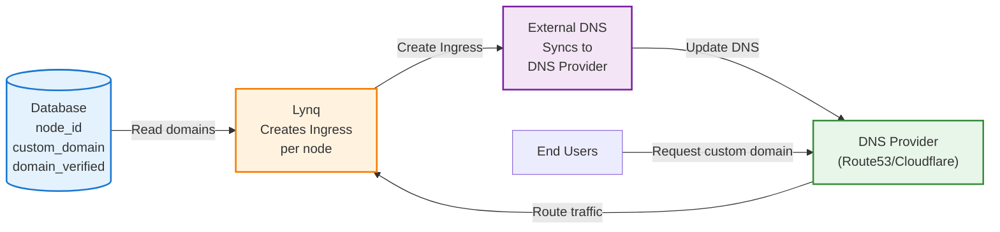

# Custom Domain Provisioning with External DNS

::: info Multi-Tenancy Example
This guide uses **Multi-Tenancy** (SaaS application with multiple customers) as an example, which is the most common use case for Lynq. The pattern shown here can be adapted for any database-driven infrastructure automation scenario.
:::

## Overview

Enable each node to have their own custom domain with automatic DNS and SSL certificate management using **Let's Encrypt** and **cert-manager**.

**Key Features:**
- Automatic DNS record creation via External DNS
- Automatic SSL certificate provisioning with Let's Encrypt
- Domain verification workflows
- CNAME delegation support

## Architecture



## Database Schema

```sql
CREATE TABLE nodes (
  node_id VARCHAR(63) PRIMARY KEY,
  subdomain VARCHAR(255) NOT NULL,           -- mycompany.saas.example.com
  custom_domain VARCHAR(255),                -- custom.com
  domain_verified BOOLEAN DEFAULT FALSE,
  cname_target VARCHAR(255),                 -- What node should CNAME to
  is_active BOOLEAN DEFAULT TRUE,
  plan_type VARCHAR(20) DEFAULT 'basic'      -- basic, pro, enterprise
);

-- Example data
INSERT INTO nodes VALUES
  ('acme-corp', 'acme', 'acme.com', TRUE, 'acme-corp.saas.example.com', TRUE, 'enterprise'),
  ('startup-x', 'startupx', 'startup-x.com', TRUE, 'startupx.saas.example.com', TRUE, 'pro'),
  ('demo-user', 'demo', NULL, FALSE, NULL, TRUE, 'basic');
```

## LynqHub Configuration

```yaml
apiVersion: operator.lynq.sh/v1
kind: LynqHub
metadata:
  name: domain-enabled-nodes
  namespace: lynq-system
spec:
  source:
    type: mysql
    syncInterval: 1m
    mysql:
      host: mysql.database.svc.cluster.local
      port: 3306
      database: nodes_db
      username: node_reader
      passwordRef:
        name: mysql-credentials
        key: password
      table: nodes

  valueMappings:
    uid: node_id
    # DEPRECATED v1.1.11+: Use extraValueMappings instead
    #     hostOrUrl: subdomain                    # Default subdomain
    activate: is_active

  extraValueMappings:
    customDomain: custom_domain
    domainVerified: domain_verified
    cnameTarget: cname_target
    planType: plan_type
```

## Prerequisites

```bash
# Install cert-manager
kubectl apply -f https://github.com/cert-manager/cert-manager/releases/download/v1.13.2/cert-manager.yaml

# Create ClusterIssuer for Let's Encrypt
kubectl apply -f - <<EOF
apiVersion: cert-manager.io/v1
kind: ClusterIssuer
metadata:
  name: letsencrypt-prod
spec:
  acme:
    server: https://acme-v02.api.letsencrypt.org/directory
    email: admin@example.com
    privateKeySecretRef:
      name: letsencrypt-prod
    solvers:
      - http01:
          ingress:
            class: nginx
EOF

# Install External DNS
helm repo add external-dns https://kubernetes-sigs.github.io/external-dns/
helm install external-dns external-dns/external-dns \
  --set provider=aws \
  --set domainFilters[0]=saas.example.com \
  --set policy=sync \
  --set registry=txt \
  --set txtOwnerId=lynq-cluster
```

## LynqForm Configuration

```yaml
apiVersion: operator.lynq.sh/v1
kind: LynqForm
metadata:
  name: custom-domain-nodes
  namespace: lynq-system
spec:
  hubId: domain-enabled-nodes

  # Create namespace per node for better isolation
  namespaces:
    - id: node-namespace
      nameTemplate: "node-{{ .uid }}"
      spec:
        apiVersion: v1
        kind: Namespace
        metadata:
          labels:
            node-id: "{{ .uid }}"
            plan-type: "{{ .planType }}"

  # ServiceAccount in node's namespace
  serviceAccounts:
    - id: app-sa
      nameTemplate: "{{ .uid }}-app"
      targetNamespace: "node-{{ .uid }}"
      dependIds: ["node-namespace"]
      spec:
        apiVersion: v1
        kind: ServiceAccount
        metadata:
          labels:
            app: "{{ .uid }}-web"
            node-id: "{{ .uid }}"
        automountServiceAccountToken: true

  # Main application deployment
  deployments:
    - id: web-app
      nameTemplate: "{{ .uid }}-web"
      targetNamespace: "node-{{ .uid }}"
      dependIds: ["node-namespace", "app-sa"]
      waitForReady: true
      timeoutSeconds: 600
      spec:
        apiVersion: apps/v1
        kind: Deployment
        metadata:
          labels:
            app: "{{ .uid }}-web"
            node-id: "{{ .uid }}"
        spec:
          replicas: 2
          selector:
            matchLabels:
              app: "{{ .uid }}-web"
              node-id: "{{ .uid }}"
          template:
            metadata:
              labels:
                app: "{{ .uid }}-web"
                node-id: "{{ .uid }}"
            spec:
              serviceAccountName: "{{ .uid }}-app"
              containers:
                - name: app
                  image: "registry.example.com/node-app:v1.2.3"
                  env:
                    - name: NODE_ID
                      value: "{{ .uid }}"
                    - name: NODE_DOMAIN
                      value: "{{ if and .customDomain (eq .domainVerified \"true\") }}{{ .customDomain }}{{ else }}{{ .uid }}.saas.example.com{{ end }}"
                    - name: PLAN_TYPE
                      value: "{{ .planType }}"
                  ports:
                    - containerPort: 8080
                      name: http
                  resources:
                    requests:
                      cpu: "{{ if eq .planType \"enterprise\" }}1000m{{ else if eq .planType \"pro\" }}500m{{ else }}200m{{ end }}"
                      memory: "{{ if eq .planType \"enterprise\" }}2Gi{{ else if eq .planType \"pro\" }}1Gi{{ else }}512Mi{{ end }}"
                    limits:
                      cpu: "{{ if eq .planType \"enterprise\" }}2000m{{ else if eq .planType \"pro\" }}1000m{{ else }}400m{{ end }}"
                      memory: "{{ if eq .planType \"enterprise\" }}4Gi{{ else if eq .planType \"pro\" }}2Gi{{ else }}1Gi{{ end }}"
                  livenessProbe:
                    httpGet:
                      path: /healthz
                      port: http
                    initialDelaySeconds: 10
                    periodSeconds: 10
                  readinessProbe:
                    httpGet:
                      path: /ready
                      port: http
                    initialDelaySeconds: 5
                    periodSeconds: 5

  # Service for the deployment
  services:
    - id: web-svc
      nameTemplate: "{{ .uid }}-web"
      targetNamespace: "node-{{ .uid }}"
      dependIds: ["web-app"]
      waitForReady: false
      spec:
        apiVersion: v1
        kind: Service
        metadata:
          labels:
            app: "{{ .uid }}-web"
            node-id: "{{ .uid }}"
        spec:
          selector:
            app: "{{ .uid }}-web"
            node-id: "{{ .uid }}"
          ports:
            - port: 80
              targetPort: http
              name: http

  # Ingress with default subdomain
  ingresses:
    - id: default-ingress
      nameTemplate: "{{ .uid }}-default"
      targetNamespace: "node-{{ .uid }}"
      dependIds: ["web-svc"]
      annotationsTemplate:
        cert-manager.io/cluster-issuer: "letsencrypt-prod"
        external-dns.alpha.kubernetes.io/hostname: "{{ .uid }}.saas.example.com"
        external-dns.alpha.kubernetes.io/ttl: "300"
        nginx.ingress.kubernetes.io/ssl-redirect: "true"
        nginx.ingress.kubernetes.io/force-ssl-redirect: "true"
      spec:
        apiVersion: networking.k8s.io/v1
        kind: Ingress
        metadata:
          labels:
            app: "{{ .uid }}-web"
            node-id: "{{ .uid }}"
          annotations:
            cert-manager.io/cluster-issuer: "letsencrypt-prod"
            external-dns.alpha.kubernetes.io/hostname: "{{ .uid }}.saas.example.com"
            external-dns.alpha.kubernetes.io/ttl: "300"
            nginx.ingress.kubernetes.io/ssl-redirect: "true"
            nginx.ingress.kubernetes.io/force-ssl-redirect: "true"
        spec:
          ingressClassName: nginx
          tls:
            - hosts:
                - "{{ .uid }}.saas.example.com"
              secretName: "{{ .uid }}-default-tls"
          rules:
            - host: "{{ .uid }}.saas.example.com"
              http:
                paths:
                  - path: /
                    pathType: Prefix
                    backend:
                      service:
                        name: "{{ .uid }}-web"
                        port:
                          number: 80
```

::: tip How It Works
- **External DNS**: Reads `external-dns.alpha.kubernetes.io/hostname` annotation and creates DNS records automatically
- **cert-manager**: Reads `cert-manager.io/cluster-issuer` annotation and provisions Let's Encrypt certificates
- **Automatic Renewal**: cert-manager renews certificates 30 days before expiration
:::

## Custom Domain Support

For nodes with verified custom domains, add additional Ingress resources:

```yaml
  # Custom domain Ingress (for verified domains)
  ingresses:
    - id: custom-ingress
      nameTemplate: "{{ .uid }}-custom"
      targetNamespace: "node-{{ .uid }}"
      dependIds: ["web-svc"]
      annotationsTemplate:
        cert-manager.io/cluster-issuer: "letsencrypt-prod"
        external-dns.alpha.kubernetes.io/hostname: "{{ .customDomain }}"
        external-dns.alpha.kubernetes.io/ttl: "300"
      spec:
        apiVersion: networking.k8s.io/v1
        kind: Ingress
        metadata:
          labels:
            app: "{{ .uid }}-web"
            node-id: "{{ .uid }}"
          annotations:
            cert-manager.io/cluster-issuer: "letsencrypt-prod"
            external-dns.alpha.kubernetes.io/hostname: "{{ .customDomain }}"
            external-dns.alpha.kubernetes.io/ttl: "300"
        spec:
          ingressClassName: nginx
          tls:
            - hosts:
                - "{{ .customDomain }}"
              secretName: "{{ .uid }}-custom-tls"
          rules:
            - host: "{{ .customDomain }}"
              http:
                paths:
                  - path: /
                    pathType: Prefix
                    backend:
                      service:
                        name: "{{ .uid }}-web"
                        port:
                          number: 80
```

**Note:** Filter nodes with verified domains using a database view:

```sql
CREATE VIEW nodes_with_custom_domains AS
SELECT * FROM nodes WHERE custom_domain IS NOT NULL AND domain_verified = TRUE;
```

Create a separate LynqHub and Template for custom domains to avoid creating Ingress for unverified domains.

## Domain Verification Workflow

1. **Node Requests Custom Domain**: User enters `custom.com` in your SaaS portal
2. **Database Update**: Portal updates `nodes.custom_domain` but keeps `domain_verified=FALSE`
3. **CNAME Target Provided**: Show user: "Point CNAME for `custom.com` to `acme-corp.saas.example.com`"
4. **Background Verification**: Your verification service checks DNS periodically
5. **Mark as Verified**: Once CNAME is detected, update `domain_verified=TRUE`
6. **Automatic Deployment**: Lynq creates Ingress with cert-manager annotation
7. **DNS Propagation**: External DNS creates Route53/Cloudflare records
8. **SSL Certificate**: cert-manager issues Let's Encrypt certificate via HTTP-01 or DNS-01 challenge
9. **Certificate Storage**: cert-manager stores certificate in Secret `<node>-custom-tls`

## Verification Commands

Verify each step of the custom domain setup:

### Verify Prerequisites

```bash
# 1. Check cert-manager is running
kubectl get pods -n cert-manager
# Expected: cert-manager, cert-manager-cainjector, cert-manager-webhook all Running

# 2. Verify ClusterIssuer is ready
kubectl get clusterissuer letsencrypt-prod -o jsonpath='{.status.conditions[?(@.type=="Ready")].status}'
# Expected: True

# 3. Check External DNS is running
kubectl get pods -l app.kubernetes.io/name=external-dns
# Expected: Running
```

### Verify Default Domain Setup

```bash
# 1. Check Ingress created for node
kubectl get ingress -n node-acme-corp

# Expected output:
# NAME                 CLASS   HOSTS                        ADDRESS       PORTS     AGE
# acme-corp-default    nginx   acme-corp.saas.example.com   10.0.0.50     80, 443   5m

# 2. Verify TLS certificate created
kubectl get certificate -n node-acme-corp

# Expected output:
# NAME                   READY   SECRET                   AGE
# acme-corp-default-tls  True    acme-corp-default-tls    5m

# 3. Check certificate details
kubectl describe certificate acme-corp-default-tls -n node-acme-corp | grep -A 5 "Status:"
# Expected: Ready: True, Message: Certificate is up to date and has not expired

# 4. Verify DNS record created
dig acme-corp.saas.example.com @8.8.8.8 +short
# Expected: 10.0.0.50 (Ingress LoadBalancer IP)

# 5. Test HTTPS access
curl -I https://acme-corp.saas.example.com
# Expected: HTTP/2 200 (or 301/302 redirect)
```

### Verify Custom Domain Setup

```bash
# After setting domain_verified = TRUE in database:

# 1. Check custom domain Ingress created
kubectl get ingress acme-corp-custom -n node-acme-corp

# Expected output:
# NAME               CLASS   HOSTS        ADDRESS       PORTS     AGE
# acme-corp-custom   nginx   acme.com     10.0.0.50     80, 443   2m

# 2. Verify custom domain certificate
kubectl get certificate acme-corp-custom-tls -n node-acme-corp -o jsonpath='{.status.conditions[?(@.type=="Ready")].status}'
# Expected: True

# 3. Check certificate covers custom domain
kubectl get secret acme-corp-custom-tls -n node-acme-corp -o jsonpath='{.data.tls\.crt}' | base64 -d | openssl x509 -noout -text | grep "DNS:"
# Expected: DNS:acme.com

# 4. Verify customer's CNAME is correct
dig acme.com CNAME +short
# Expected: acme-corp.saas.example.com.

# 5. Test custom domain access
curl -I https://acme.com
# Expected: HTTP/2 200
```

### Complete Verification Script

```bash
#!/bin/bash
# verify-custom-domain.sh <node-id> <custom-domain>

NODE_ID=$1
CUSTOM_DOMAIN=$2
NAMESPACE="node-${NODE_ID}"
DEFAULT_DOMAIN="${NODE_ID}.saas.example.com"

echo "=== Verifying Custom Domain Setup for ${NODE_ID} ==="
echo ""

# Check LynqNode status
echo "1. LynqNode Status:"
kubectl get lynqnode ${NODE_ID}-custom-domain-nodes -o jsonpath='{.status.conditions[?(@.type=="Ready")].status}'
echo ""

# Check default Ingress
echo "2. Default Ingress (${DEFAULT_DOMAIN}):"
kubectl get ingress ${NODE_ID}-default -n ${NAMESPACE} -o wide 2>/dev/null || echo "   Not found"

# Check custom Ingress
echo "3. Custom Ingress (${CUSTOM_DOMAIN}):"
kubectl get ingress ${NODE_ID}-custom -n ${NAMESPACE} -o wide 2>/dev/null || echo "   Not found (domain not verified?)"

# Check certificates
echo "4. TLS Certificates:"
kubectl get certificates -n ${NAMESPACE}

# Check DNS resolution
echo "5. DNS Resolution:"
echo "   Default: $(dig +short ${DEFAULT_DOMAIN} @8.8.8.8)"
echo "   Custom:  $(dig +short ${CUSTOM_DOMAIN} @8.8.8.8)"
echo "   CNAME:   $(dig +short ${CUSTOM_DOMAIN} CNAME)"

# Check HTTPS connectivity
echo "6. HTTPS Connectivity:"
echo "   Default: $(curl -s -o /dev/null -w "%{http_code}" https://${DEFAULT_DOMAIN}/healthz 2>/dev/null || echo "Failed")"
echo "   Custom:  $(curl -s -o /dev/null -w "%{http_code}" https://${CUSTOM_DOMAIN}/healthz 2>/dev/null || echo "Failed")"

echo ""
echo "=== Verification Complete ==="
```

Usage:
```bash
./verify-custom-domain.sh acme-corp acme.com

# Example output:
# === Verifying Custom Domain Setup for acme-corp ===
#
# 1. LynqNode Status:
# True
#
# 2. Default Ingress (acme-corp.saas.example.com):
# NAME               CLASS   HOSTS                        ADDRESS     PORTS     AGE
# acme-corp-default  nginx   acme-corp.saas.example.com   10.0.0.50   80, 443   1h
#
# 3. Custom Ingress (acme.com):
# NAME             CLASS   HOSTS      ADDRESS     PORTS     AGE
# acme-corp-custom nginx   acme.com   10.0.0.50   80, 443   30m
#
# 4. TLS Certificates:
# NAME                     READY   SECRET                    AGE
# acme-corp-default-tls    True    acme-corp-default-tls     1h
# acme-corp-custom-tls     True    acme-corp-custom-tls      30m
#
# 5. DNS Resolution:
#    Default: 10.0.0.50
#    Custom:  10.0.0.50
#    CNAME:   acme-corp.saas.example.com.
#
# 6. HTTPS Connectivity:
#    Default: 200
#    Custom:  200
#
# === Verification Complete ===
```

### Troubleshooting Certificate Issues

```bash
# Check certificate request status
kubectl get certificaterequest -n node-acme-corp

# Check cert-manager logs for errors
kubectl logs -n cert-manager -l app=cert-manager --tail=100 | grep acme-corp

# Describe certificate for detailed status
kubectl describe certificate acme-corp-custom-tls -n node-acme-corp

# Check ACME challenge status (if pending)
kubectl get challenges -n node-acme-corp

# Example challenge status:
# NAME                                     STATE     DOMAIN     AGE
# acme-corp-custom-tls-xxxxx-yyyyy-zzzzz   pending   acme.com   2m

# If challenge stuck, describe it:
kubectl describe challenge -n node-acme-corp
# Look for: "Waiting for HTTP-01 challenge propagation" or similar
```

## Monitoring

```promql
# Count nodes with custom domains
sum(lynqnode_resources_ready{resource_name=~".*-ingress"})

# Alert on ingress failures
ALERT CustomDomainIngressFailed
  FOR 10m
  WHERE lynqnode_resources_failed{resource_name=~".*-ingress"} > 0
  ANNOTATIONS {
    summary = "Ingress failed for node {{ $labels.node }}"
  }
```

## Best Practices

1. **Domain Verification**: Always verify domain ownership before creating Ingress
2. **Rate Limiting**: Implement rate limits for domain addition per node
3. **DNS TTL**: Use low TTL (300s) during initial setup for faster propagation
4. **Certificate Monitoring**: Monitor cert-manager for SSL provisioning issues
5. **Fallback Strategy**: Keep default subdomain active even with custom domain
6. **Wildcard Support**: For enterprise plans, support `*.custom.com` patterns

## Related Documentation

- [External DNS Integration](/integration-external-dns) - Detailed DNS configuration
- [Templates Guide](/templates) - Template syntax and functions
- [Policies](/policies) - Resource lifecycle management
- [Advanced Use Cases](/advanced-use-cases) - Other patterns

## Next Steps

- Implement domain verification service
- Set up monitoring and alerting
- Configure rate limiting
- Test SSL certificate provisioning
