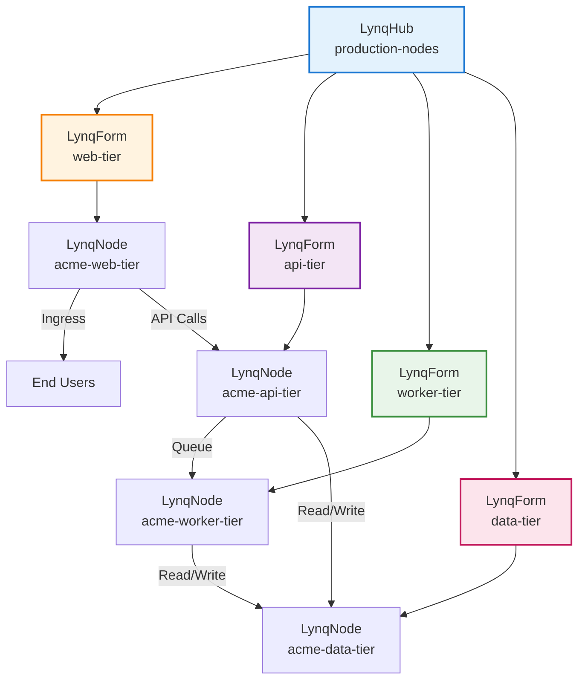
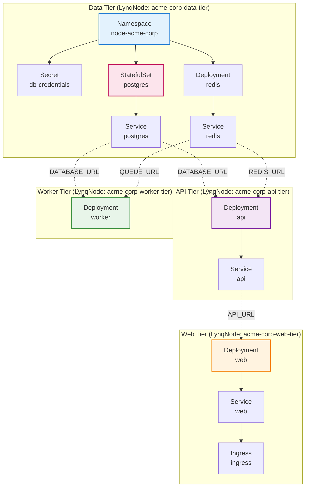

# Multi-Tier Application Stack

::: info Multi-Tenancy Example
This guide uses **Multi-Tenancy** (SaaS application with multiple customers) as an example, which is the most common use case for Lynq. The pattern shown here can be adapted for any database-driven infrastructure automation scenario.
:::

## Overview

Deploy complex applications spanning multiple services (web, API, workers, caches) using multiple templates per node. Each template handles a specific tier of the stack.

## Architecture



## Database Schema

```sql
CREATE TABLE nodes (
  node_id VARCHAR(63) PRIMARY KEY,
  domain VARCHAR(255) NOT NULL,
  is_active BOOLEAN DEFAULT TRUE,

  -- Resource allocation per tier
  web_replicas INT DEFAULT 2,
  api_replicas INT DEFAULT 3,
  worker_replicas INT DEFAULT 2,

  -- Database configuration
  db_size VARCHAR(10) DEFAULT 'small',      -- small, medium, large

  -- Feature flags
  enable_analytics BOOLEAN DEFAULT FALSE,
  enable_notifications BOOLEAN DEFAULT TRUE,

  created_at TIMESTAMP DEFAULT CURRENT_TIMESTAMP,
  updated_at TIMESTAMP DEFAULT CURRENT_TIMESTAMP ON UPDATE CURRENT_TIMESTAMP
);
```

## LynqHub

```yaml
apiVersion: operator.lynq.sh/v1
kind: LynqHub
metadata:
  name: multi-tier-nodes
  namespace: lynq-system
spec:
  source:
    type: mysql
    syncInterval: 1m
    mysql:
      host: mysql.database.svc.cluster.local
      port: 3306
      database: nodes_db
      username: node_reader
      passwordRef:
        name: mysql-credentials
        key: password
      table: nodes

  valueMappings:
    uid: node_id
    # DEPRECATED v1.1.11+: Use extraValueMappings instead
    #     hostOrUrl: domain
    activate: is_active

  extraValueMappings:
    webReplicas: web_replicas
    apiReplicas: api_replicas
    workerReplicas: worker_replicas
    dbSize: db_size
    enableAnalytics: enable_analytics
    enableNotifications: enable_notifications
```

## Template 1: Data Tier

```yaml
apiVersion: operator.lynq.sh/v1
kind: LynqForm
metadata:
  name: data-tier
  namespace: lynq-system
spec:
  hubId: multi-tier-nodes

  # Create node namespace
  namespaces:
    - id: node-namespace
      nameTemplate: "node-{{ .uid }}"
      spec:
        apiVersion: v1
        kind: Namespace
        metadata:
          labels:
            node-id: "{{ .uid }}"
            tier: data

  # PostgreSQL StatefulSet
  statefulSets:
    - id: postgres
      nameTemplate: "{{ .uid }}-postgres"
      targetNamespace: "node-{{ .uid }}"
      dependIds: ["node-namespace"]
      creationPolicy: Once  # Database should be created once
      deletionPolicy: Retain  # Keep data even if node deleted
      waitForReady: true
      timeoutSeconds: 600
      spec:
        apiVersion: apps/v1
        kind: StatefulSet
        metadata:
          labels:
            app: "{{ .uid }}-postgres"
            tier: data
        spec:
          serviceName: "{{ .uid }}-postgres"
          replicas: 1
          selector:
            matchLabels:
              app: "{{ .uid }}-postgres"
          template:
            metadata:
              labels:
                app: "{{ .uid }}-postgres"
                tier: data
            spec:
              containers:
                - name: postgres
                  image: postgres:15-alpine
                  env:
                    - name: POSTGRES_DB
                      value: "{{ .uid }}"
                    - name: POSTGRES_USER
                      value: "{{ .uid }}"
                    - name: POSTGRES_PASSWORD
                      valueFrom:
                        secretKeyRef:
                          name: "{{ .uid }}-db-credentials"
                          key: password
                    - name: PGDATA
                      value: /var/lib/postgresql/data/pgdata
                  ports:
                    - containerPort: 5432
                      name: postgres
                  volumeMounts:
                    - name: data
                      mountPath: /var/lib/postgresql/data
                  resources:
                    requests:
                      cpu: "{{ if eq .dbSize \"large\" }}2000m{{ else if eq .dbSize \"medium\" }}1000m{{ else }}500m{{ end }}"
                      memory: "{{ if eq .dbSize \"large\" }}4Gi{{ else if eq .dbSize \"medium\" }}2Gi{{ else }}1Gi{{ end }}"
          volumeClaimTemplates:
            - metadata:
                name: data
              spec:
                accessModes: ["ReadWriteOnce"]
                resources:
                  requests:
                    storage: "{{ if eq .dbSize \"large\" }}100Gi{{ else if eq .dbSize \"medium\" }}50Gi{{ else }}20Gi{{ end }}"

  # PostgreSQL Service
  services:
    - id: postgres-svc
      nameTemplate: "{{ .uid }}-postgres"
      targetNamespace: "node-{{ .uid }}"
      dependIds: ["postgres"]
      spec:
        apiVersion: v1
        kind: Service
        metadata:
          labels:
            app: "{{ .uid }}-postgres"
            tier: data
        spec:
          clusterIP: None  # Headless service for StatefulSet
          selector:
            app: "{{ .uid }}-postgres"
          ports:
            - port: 5432
              targetPort: postgres

  # Redis cache deployment
  deployments:
    - id: redis
      nameTemplate: "{{ .uid }}-redis"
      targetNamespace: "node-{{ .uid }}"
      dependIds: ["node-namespace"]
      waitForReady: true
      spec:
        apiVersion: apps/v1
        kind: Deployment
        metadata:
          labels:
            app: "{{ .uid }}-redis"
            tier: cache
        spec:
          replicas: 1
          selector:
            matchLabels:
              app: "{{ .uid }}-redis"
          template:
            metadata:
              labels:
                app: "{{ .uid }}-redis"
                tier: cache
            spec:
              containers:
                - name: redis
                  image: redis:7-alpine
                  ports:
                    - containerPort: 6379
                      name: redis
                  resources:
                    requests:
                      cpu: 200m
                      memory: 512Mi
                    limits:
                      cpu: 400m
                      memory: 1Gi

  # Redis Service
  services:
    - id: redis-svc
      nameTemplate: "{{ .uid }}-redis"
      targetNamespace: "node-{{ .uid }}"
      dependIds: ["redis"]
      spec:
        apiVersion: v1
        kind: Service
        metadata:
          labels:
            app: "{{ .uid }}-redis"
            tier: cache
        spec:
          selector:
            app: "{{ .uid }}-redis"
          ports:
            - port: 6379
              targetPort: redis

  # Database credentials secret
  secrets:
    - id: db-credentials
      nameTemplate: "{{ .uid }}-db-credentials"
      targetNamespace: "node-{{ .uid }}"
      dependIds: ["node-namespace"]
      creationPolicy: Once  # Generate password once
      spec:
        apiVersion: v1
        kind: Secret
        metadata:
          labels:
            app: "{{ .uid }}-postgres"
            tier: data
        stringData:
          password: "{{ randAlphaNum 32 }}"
          connection-string: "postgresql://{{ .uid }}:REPLACE_WITH_PASSWORD@{{ .uid }}-postgres:5432/{{ .uid }}"
```

::: tip Secret Generation
The `randAlphaNum` function generates a random password. In production, consider using External Secrets Operator to fetch secrets from a vault.
:::

## Template 2: API Tier

```yaml
apiVersion: operator.lynq.sh/v1
kind: LynqForm
metadata:
  name: api-tier
  namespace: lynq-system
spec:
  hubId: multi-tier-nodes

  deployments:
    - id: api
      nameTemplate: "{{ .uid }}-api"
      targetNamespace: "node-{{ .uid }}"
      waitForReady: true
      timeoutSeconds: 600
      spec:
        apiVersion: apps/v1
        kind: Deployment
        metadata:
          labels:
            app: "{{ .uid }}-api"
            tier: api
        spec:
          replicas: {{ .apiReplicas }}
          strategy:
            type: RollingUpdate
            rollingUpdate:
              maxSurge: 1
              maxUnavailable: 0
          selector:
            matchLabels:
              app: "{{ .uid }}-api"
              tier: api
          template:
            metadata:
              labels:
                app: "{{ .uid }}-api"
                tier: api
            spec:
              containers:
                - name: api
                  image: registry.example.com/node-api:v2.0.0
                  env:
                    - name: NODE_ID
                      value: "{{ .uid }}"
                    - name: DATABASE_URL
                      valueFrom:
                        secretKeyRef:
                          name: "{{ .uid }}-db-credentials"
                          key: connection-string
                    - name: REDIS_URL
                      value: "redis://{{ .uid }}-redis:6379"
                    - name: ENABLE_ANALYTICS
                      value: "{{ .enableAnalytics }}"
                  ports:
                    - containerPort: 8080
                      name: http
                  resources:
                    requests:
                      cpu: 500m
                      memory: 1Gi
                    limits:
                      cpu: 1000m
                      memory: 2Gi
                  livenessProbe:
                    httpGet:
                      path: /healthz
                      port: http
                    initialDelaySeconds: 30
                    periodSeconds: 10
                  readinessProbe:
                    httpGet:
                      path: /ready
                      port: http
                    initialDelaySeconds: 10
                    periodSeconds: 5

  services:
    - id: api-svc
      nameTemplate: "{{ .uid }}-api"
      targetNamespace: "node-{{ .uid }}"
      dependIds: ["api"]
      spec:
        apiVersion: v1
        kind: Service
        metadata:
          labels:
            app: "{{ .uid }}-api"
            tier: api
        spec:
          selector:
            app: "{{ .uid }}-api"
          ports:
            - port: 8080
              targetPort: http
```

## Template 3: Web Tier

```yaml
apiVersion: operator.lynq.sh/v1
kind: LynqForm
metadata:
  name: web-tier
  namespace: lynq-system
spec:
  hubId: multi-tier-nodes

  deployments:
    - id: web
      nameTemplate: "{{ .uid }}-web"
      targetNamespace: "node-{{ .uid }}"
      waitForReady: true
      spec:
        apiVersion: apps/v1
        kind: Deployment
        metadata:
          labels:
            app: "{{ .uid }}-web"
            tier: web
        spec:
          replicas: {{ .webReplicas }}
          selector:
            matchLabels:
              app: "{{ .uid }}-web"
              tier: web
          template:
            metadata:
              labels:
                app: "{{ .uid }}-web"
                tier: web
            spec:
              containers:
                - name: web
                  image: registry.example.com/node-web:v2.0.0
                  env:
                    - name: NODE_ID
                      value: "{{ .uid }}"
                    - name: API_URL
                      value: "http://{{ .uid }}-api:8080"
                  ports:
                    - containerPort: 3000
                      name: http
                  resources:
                    requests:
                      cpu: 200m
                      memory: 512Mi

  services:
    - id: web-svc
      nameTemplate: "{{ .uid }}-web"
      targetNamespace: "node-{{ .uid }}"
      dependIds: ["web"]
      spec:
        apiVersion: v1
        kind: Service
        metadata:
          labels:
            app: "{{ .uid }}-web"
            tier: web
        spec:
          selector:
            app: "{{ .uid }}-web"
          ports:
            - port: 80
              targetPort: http

  ingresses:
    - id: web-ingress
      nameTemplate: "{{ .uid }}-ingress"
      targetNamespace: "node-{{ .uid }}"
      dependIds: ["web-svc"]
      spec:
        apiVersion: networking.k8s.io/v1
        kind: Ingress
        metadata:
          labels:
            app: "{{ .uid }}-web"
            tier: web
        spec:
          ingressClassName: nginx
          rules:
            - host: "{{ .uid }}.example.com"
              http:
                paths:
                  - path: /
                    pathType: Prefix
                    backend:
                      service:
                        name: "{{ .uid }}-web"
                        port:
                          number: 80
```

## Template 4: Worker Tier

```yaml
apiVersion: operator.lynq.sh/v1
kind: LynqForm
metadata:
  name: worker-tier
  namespace: lynq-system
spec:
  hubId: multi-tier-nodes

  deployments:
    - id: worker
      nameTemplate: "{{ .uid }}-worker"
      targetNamespace: "node-{{ .uid }}"
      waitForReady: true
      spec:
        apiVersion: apps/v1
        kind: Deployment
        metadata:
          labels:
            app: "{{ .uid }}-worker"
            tier: worker
        spec:
          replicas: {{ .workerReplicas }}
          selector:
            matchLabels:
              app: "{{ .uid }}-worker"
              tier: worker
          template:
            metadata:
              labels:
                app: "{{ .uid }}-worker"
                tier: worker
            spec:
              containers:
                - name: worker
                  image: registry.example.com/node-worker:v2.0.0
                  env:
                    - name: NODE_ID
                      value: "{{ .uid }}"
                    - name: DATABASE_URL
                      valueFrom:
                        secretKeyRef:
                          name: "{{ .uid }}-db-credentials"
                          key: connection-string
                    - name: REDIS_URL
                      value: "redis://{{ .uid }}-redis:6379"
                    - name: QUEUE_URL
                      value: "redis://{{ .uid }}-redis:6379"
                    - name: ENABLE_NOTIFICATIONS
                      value: "{{ .enableNotifications }}"
                  resources:
                    requests:
                      cpu: 300m
                      memory: 768Mi
                  livenessProbe:
                    exec:
                      command: ["pgrep", "-f", "worker"]
                    initialDelaySeconds: 30
                    periodSeconds: 30
```

## Resource Dependency Graph

Each tier deploys resources in a specific order based on dependencies. Here's the complete dependency graph:



### Apply Order Within Each Tier

**Data Tier** (applies first, others depend on it):
1. `node-namespace` - Creates isolated namespace
2. `db-credentials` (depends on namespace) - Generates database password
3. `postgres` (depends on namespace) - PostgreSQL StatefulSet
4. `redis` (depends on namespace) - Redis deployment
5. `postgres-svc` (depends on postgres) - PostgreSQL service
6. `redis-svc` (depends on redis) - Redis service

**API Tier** (requires data tier services):
1. `api` - API deployment (uses `DATABASE_URL`, `REDIS_URL` from data tier)
2. `api-svc` (depends on api) - API service

**Web Tier** (requires API service):
1. `web` - Web deployment (uses `API_URL` from api tier)
2. `web-svc` (depends on web) - Web service
3. `web-ingress` (depends on web-svc) - Ingress for external access

**Worker Tier** (requires data tier services):
1. `worker` - Worker deployment (uses `DATABASE_URL`, `QUEUE_URL` from data tier)

### Startup Timeline

| Time | Data Tier | API Tier | Web Tier | Worker Tier |
|------|-----------|----------|----------|-------------|
| T+0 | Creating namespace... | Waiting | Waiting | Waiting |
| T+10s | Creating secrets, StatefulSet... | Waiting | Waiting | Waiting |
| T+30s | PostgreSQL starting... | Waiting | Waiting | Waiting |
| T+60s | PostgreSQL ready, Redis ready | Starting API... | Waiting | Starting worker... |
| T+90s | All ready | API ready | Starting web... | Worker ready |
| T+120s | All ready | All ready | Web + Ingress ready | All ready |

**Total provisioning time**: ~2-3 minutes per node

## Deployment Verification

```bash
# Check all tiers for a node
kubectl get lynqnodes -n lynq-system | grep acme-corp

# Expected output:
# acme-corp-data-tier     True    5/5     0       10m
# acme-corp-api-tier      True    3/3     0       10m
# acme-corp-web-tier      True    2/2     0       10m
# acme-corp-worker-tier   True    2/2     0       10m

# Verify resources in node namespace
kubectl get all -n node-acme-corp
```

### Complete Multi-Tier Verification Script

```bash
#!/bin/bash
# verify-multi-tier.sh <node-id>

NODE_ID=$1
NAMESPACE="node-${NODE_ID}"

echo "=== Multi-Tier Stack Verification for ${NODE_ID} ==="
echo ""

# Check all LynqNodes for this node
echo "1. LynqNode Status (all tiers):"
kubectl get lynqnode -n lynq-system | grep ${NODE_ID}
echo ""

# Data Tier
echo "2. Data Tier:"
echo "   PostgreSQL:"
kubectl get statefulset ${NODE_ID}-postgres -n ${NAMESPACE} -o jsonpath='   Replicas: {.status.readyReplicas}/{.spec.replicas}'
echo ""
echo "   Redis:"
kubectl get deployment ${NODE_ID}-redis -n ${NAMESPACE} -o jsonpath='   Replicas: {.status.readyReplicas}/{.spec.replicas}'
echo ""

# API Tier
echo "3. API Tier:"
kubectl get deployment ${NODE_ID}-api -n ${NAMESPACE} -o jsonpath='   Replicas: {.status.readyReplicas}/{.spec.replicas}'
echo ""

# Web Tier
echo "4. Web Tier:"
kubectl get deployment ${NODE_ID}-web -n ${NAMESPACE} -o jsonpath='   Replicas: {.status.readyReplicas}/{.spec.replicas}'
echo ""
echo "   Ingress:"
kubectl get ingress ${NODE_ID}-ingress -n ${NAMESPACE} -o jsonpath='   Host: {.spec.rules[0].host}'
echo ""

# Worker Tier
echo "5. Worker Tier:"
kubectl get deployment ${NODE_ID}-worker -n ${NAMESPACE} -o jsonpath='   Replicas: {.status.readyReplicas}/{.spec.replicas}'
echo ""

# Service connectivity
echo "6. Service Connectivity:"
echo "   PostgreSQL: $(kubectl get svc ${NODE_ID}-postgres -n ${NAMESPACE} -o jsonpath='{.spec.clusterIP}'):5432"
echo "   Redis: $(kubectl get svc ${NODE_ID}-redis -n ${NAMESPACE} -o jsonpath='{.spec.clusterIP}'):6379"
echo "   API: $(kubectl get svc ${NODE_ID}-api -n ${NAMESPACE} -o jsonpath='{.spec.clusterIP}'):8080"
echo "   Web: $(kubectl get svc ${NODE_ID}-web -n ${NAMESPACE} -o jsonpath='{.spec.clusterIP}'):80"

# Health check
echo ""
echo "7. Health Checks:"
echo "   API: $(kubectl exec deployment/${NODE_ID}-api -n ${NAMESPACE} -- curl -s localhost:8080/healthz 2>/dev/null || echo "N/A")"
echo "   Web: $(kubectl exec deployment/${NODE_ID}-web -n ${NAMESPACE} -- curl -s localhost:3000/healthz 2>/dev/null || echo "N/A")"

echo ""
echo "=== Verification Complete ==="
```

Example output:
```
=== Multi-Tier Stack Verification for acme-corp ===

1. LynqNode Status (all tiers):
acme-corp-data-tier     True    5/5     0       15m
acme-corp-api-tier      True    2/2     0       15m
acme-corp-web-tier      True    3/3     0       15m
acme-corp-worker-tier   True    1/1     0       15m

2. Data Tier:
   PostgreSQL:
   Replicas: 1/1
   Redis:
   Replicas: 1/1

3. API Tier:
   Replicas: 3/3

4. Web Tier:
   Replicas: 2/2
   Ingress:
   Host: acme-corp.example.com

5. Worker Tier:
   Replicas: 2/2

6. Service Connectivity:
   PostgreSQL: 10.96.123.45:5432
   Redis: 10.96.123.46:6379
   API: 10.96.123.47:8080
   Web: 10.96.123.48:80

7. Health Checks:
   API: {"status":"healthy","database":"connected","redis":"connected"}
   Web: {"status":"healthy"}

=== Verification Complete ===
```

## Benefits

1. **Separation of Concerns**: Each tier managed independently
2. **Flexible Scaling**: Scale web, API, workers independently per node
3. **Gradual Updates**: Update one tier at a time
4. **Resource Policies**: Different creation/deletion policies per tier
5. **Dependency Management**: Implicit via service discovery, explicit via health checks

## Related Documentation

- [Architecture](/architecture) - System design overview
- [Dependencies](/dependencies) - Resource ordering and dependencies
- [Policies](/policies) - Lifecycle management
- [Advanced Use Cases](/advanced-use-cases) - Other patterns

## Next Steps

- Implement health checks for all tiers
- Set up monitoring per tier
- Configure auto-scaling for web and API tiers
- Implement backup strategy for data tier
