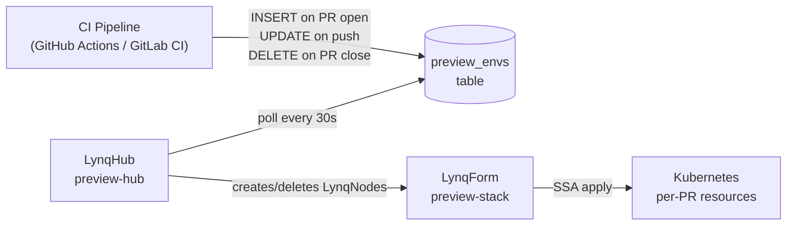

# Per-PR Preview Environments

Your CI pipeline inserts one row per open pull request. Lynq provisions a full preview environment — Namespace, Deployment, Ingress, and TLS — within a minute. When the PR closes, the row is deleted and every resource is cleaned up automatically.

## Why This Fits Lynq

Preview environments are inherently data-driven: each environment maps 1:1 to a PR row. The lifecycle is short, high-churn, and repetitive — exactly the pattern Lynq is designed for.

| Without Lynq | With Lynq |
|---|---|
| CI runs `helm install` per PR | CI runs `INSERT INTO preview_envs ...` |
| Cleanup requires a separate CI job | Row deletion triggers automatic cleanup |
| Drift accumulates when jobs fail | Lynq reconciles continuously |
| Scaling to 100+ open PRs degrades CI | Lynq handles N environments in parallel |

## Architecture



## Database Schema

```sql
CREATE TABLE preview_environments (
  env_id       VARCHAR(63) PRIMARY KEY,   -- e.g. 'pr-1234'
  repo         VARCHAR(255) NOT NULL,
  branch       VARCHAR(255) NOT NULL,
  commit_sha   VARCHAR(40)  NOT NULL,
  image_tag    VARCHAR(255) NOT NULL,     -- fully-qualified Docker image
  base_domain  VARCHAR(255) NOT NULL,     -- e.g. 'preview.company.com'
  ttl_hours    INT          DEFAULT 48,
  opened_by    VARCHAR(100),
  is_active    BOOLEAN      DEFAULT TRUE,
  created_at   TIMESTAMP    DEFAULT CURRENT_TIMESTAMP,
  updated_at   TIMESTAMP    DEFAULT CURRENT_TIMESTAMP ON UPDATE CURRENT_TIMESTAMP
);
```

## CI Integration

```bash
# On PR open / commit push
mysql -e "
  INSERT INTO preview_environments
    (env_id, repo, branch, commit_sha, image_tag, base_domain, opened_by)
  VALUES
    ('pr-$PR_NUMBER', '$REPO', '$BRANCH', '$SHA', '$IMAGE', 'preview.company.com', '$ACTOR')
  ON DUPLICATE KEY UPDATE
    commit_sha = VALUES(commit_sha),
    image_tag  = VALUES(image_tag),
    updated_at = NOW();
"

# On PR close / merge
mysql -e "DELETE FROM preview_environments WHERE env_id = 'pr-$PR_NUMBER';"
```

## LynqHub

```yaml
apiVersion: operator.lynq.sh/v1
kind: LynqHub
metadata:
  name: preview-hub
  namespace: lynq-system
spec:
  source:
    type: mysql
    syncInterval: 30s    # fast polling — new PRs should appear quickly
    mysql:
      host: mysql.internal.svc.cluster.local
      port: 3306
      database: ci_db
      table: preview_environments
      username: lynq_reader
      passwordRef:
        name: mysql-credentials
        key: password

  valueMappings:
    uid: env_id
    activate: is_active

  extraValueMappings:
    imageTag: image_tag
    branch: branch
    commitSha: commit_sha
    baseDomain: base_domain
    openedBy: opened_by
```

## LynqForm

```yaml
apiVersion: operator.lynq.sh/v1
kind: LynqForm
metadata:
  name: preview-stack
  namespace: lynq-system
spec:
  hubId: preview-hub

  # 1. Isolated namespace per PR
  namespaces:
    - id: ns
      nameTemplate: "preview-{{ .uid }}"
      spec:
        apiVersion: v1
        kind: Namespace
        metadata:
          labels:
            preview-env: "{{ .uid }}"
            opened-by: "{{ .openedBy }}"

  # 2. Application deployment — redeploys on each commit push
  deployments:
    - id: app
      nameTemplate: "{{ .uid }}-app"
      targetNamespace: "preview-{{ .uid }}"
      dependIds: ["ns"]
      deletionPolicy: Delete
      waitForReady: true
      timeoutSeconds: 300
      spec:
        apiVersion: apps/v1
        kind: Deployment
        metadata:
          labels:
            app: "{{ .uid }}"
            commit: "{{ .commitSha }}"
        spec:
          replicas: 1
          selector:
            matchLabels:
              app: "{{ .uid }}"
          template:
            metadata:
              labels:
                app: "{{ .uid }}"
                commit: "{{ .commitSha }}"
            spec:
              containers:
                - name: app
                  image: "{{ .imageTag }}"
                  ports:
                    - containerPort: 8080
                  env:
                    - name: PREVIEW_ENV_ID
                      value: "{{ .uid }}"
                    - name: BRANCH
                      value: "{{ .branch }}"
                  resources:
                    requests:
                      cpu: 200m
                      memory: 256Mi
                    limits:
                      cpu: 500m
                      memory: 512Mi

  # 3. ClusterIP service
  services:
    - id: svc
      nameTemplate: "{{ .uid }}-svc"
      targetNamespace: "preview-{{ .uid }}"
      dependIds: ["app"]
      deletionPolicy: Delete
      spec:
        apiVersion: v1
        kind: Service
        metadata:
          labels:
            app: "{{ .uid }}"
        spec:
          selector:
            app: "{{ .uid }}"
          ports:
            - port: 80
              targetPort: 8080

  # 4. Ingress with TLS (cert-manager ClusterIssuer required)
  ingresses:
    - id: ingress
      nameTemplate: "{{ .uid }}-ingress"
      targetNamespace: "preview-{{ .uid }}"
      dependIds: ["svc"]
      deletionPolicy: Delete
      spec:
        apiVersion: networking.k8s.io/v1
        kind: Ingress
        metadata:
          annotations:
            cert-manager.io/cluster-issuer: letsencrypt-prod
            nginx.ingress.kubernetes.io/proxy-read-timeout: "60"
        spec:
          ingressClassName: nginx
          tls:
            - hosts:
                - "{{ .uid }}.{{ .baseDomain }}"
              secretName: "{{ .uid }}-tls"
          rules:
            - host: "{{ .uid }}.{{ .baseDomain }}"
              http:
                paths:
                  - path: /
                    pathType: Prefix
                    backend:
                      service:
                        name: "{{ .uid }}-svc"
                        port:
                          number: 80
```

## Policy Notes

| Policy | Setting | Why |
|---|---|---|
| `deletionPolicy` | `Delete` | Environments are ephemeral — always clean up |
| `waitForReady: true` | on `app` | Ingress shouldn't point to a pod that hasn't started |
| `syncInterval: 30s` | on hub | New PRs should have an environment within ~30 seconds |
| `maxSkew` | optional | Set to `5` if 100+ PRs open simultaneously causes too much churn |

## Checking Environment Status

```bash
# List all active preview environments
kubectl get lynqnodes -n lynq-system -l lynq.sh/hub=preview-hub

# Get the URL for PR 1234
kubectl get ingress -n preview-pr-1234

# Watch creation in real time after a PR opens
kubectl get lynqnodes -n lynq-system -w
```

## Automatic TTL Cleanup

Add a scheduled job or database trigger to expire stale environments:

```sql
-- Deactivate environments older than their TTL
UPDATE preview_environments
SET is_active = FALSE
WHERE is_active = TRUE
  AND created_at < NOW() - INTERVAL ttl_hours HOUR;

-- Or hard-delete them (Lynq will clean up the resources)
DELETE FROM preview_environments
WHERE is_active = TRUE
  AND created_at < NOW() - INTERVAL ttl_hours HOUR;
```

## See Also

- [Custom Domain Provisioning](./use-case-custom-domains.md) — add per-PR subdomains with ExternalDNS
- [Policies](./policies.md) — `deletionPolicy`, `creationPolicy`, `maxSkew`
- [Datasource Configuration](./datasource.md) — LynqHub connection setup
