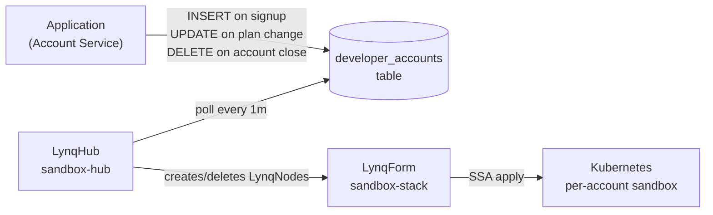

# Developer Sandbox Environments

Stripe provisions a complete isolated environment for every test-mode API key. Twilio does the same per customer account. Lynq implements that pattern: each developer account row in your database gets a dedicated namespace, mock services, and configuration — provisioned automatically, cleaned up completely.

## Why This Fits Lynq

Sandbox environments are data-driven by nature: they map 1:1 to account records that your application already manages. The lifecycle follows account activity — created when an account activates, torn down when it's closed or downgraded.

| Without Lynq | With Lynq |
|---|---|
| Ops team manually provisions sandbox per customer | Account creation triggers sandbox automatically |
| Shared sandbox causes test data collisions | Each account gets a fully isolated namespace |
| Cleanup is a runbook that gets skipped | Row deletion tears down every resource |
| Scaling to 1000 accounts requires automation scripting | Lynq reconciles N accounts in parallel |

## Architecture



## Database Schema

```sql
CREATE TABLE developer_accounts (
  account_id     VARCHAR(63)  PRIMARY KEY,   -- e.g. 'acct_1234abc'
  plan_type      VARCHAR(20)  NOT NULL DEFAULT 'free',  -- free, starter, growth, enterprise
  region         VARCHAR(20)  NOT NULL DEFAULT 'us-east-1',
  is_active      BOOLEAN      DEFAULT TRUE,

  -- Pre-computed resource limits derived from plan_type.
  -- Set by application layer or a DB view when plan_type changes.
  api_replicas   INT          DEFAULT 1,
  rate_limit_rps INT          DEFAULT 100,
  storage_gb     INT          DEFAULT 5,

  owner_email    VARCHAR(255),
  created_at     TIMESTAMP    DEFAULT CURRENT_TIMESTAMP,
  closed_at      TIMESTAMP    NULL
);
```

```sql
-- Example: view that pre-computes limits so templates stay simple
CREATE VIEW developer_accounts_with_limits AS
SELECT *,
  CASE plan_type
    WHEN 'enterprise' THEN 4
    WHEN 'growth'     THEN 2
    ELSE 1
  END AS api_replicas,
  CASE plan_type
    WHEN 'enterprise' THEN 5000
    WHEN 'growth'     THEN 1000
    WHEN 'starter'    THEN 300
    ELSE 100
  END AS rate_limit_rps,
  CASE plan_type
    WHEN 'enterprise' THEN 100
    WHEN 'growth'     THEN 20
    WHEN 'starter'    THEN 10
    ELSE 5
  END AS storage_gb
FROM developer_accounts
WHERE is_active = TRUE AND closed_at IS NULL;
```

## LynqHub

```yaml
apiVersion: operator.lynq.sh/v1
kind: LynqHub
metadata:
  name: sandbox-hub
  namespace: lynq-system
spec:
  source:
    type: mysql
    syncInterval: 1m
    mysql:
      host: mysql.internal.svc.cluster.local
      port: 3306
      database: accounts_db
      table: developer_accounts_with_limits
      username: lynq_reader
      passwordRef:
        name: mysql-credentials
        key: password

  valueMappings:
    uid: account_id
    activate: is_active

  extraValueMappings:
    planType: plan_type
    region: region
    apiReplicas: api_replicas
    rateLimitRps: rate_limit_rps
    storageGb: storage_gb
    ownerEmail: owner_email
```

## LynqForm

```yaml
apiVersion: operator.lynq.sh/v1
kind: LynqForm
metadata:
  name: sandbox-stack
  namespace: lynq-system
spec:
  hubId: sandbox-hub

  # 1. Isolated namespace per account
  namespaces:
    - id: ns
      nameTemplate: "sandbox-{{ .uid }}"
      spec:
        apiVersion: v1
        kind: Namespace
        metadata:
          labels:
            sandbox-account: "{{ .uid }}"
            plan-type: "{{ .planType }}"
            region: "{{ .region }}"

  # 2. Account-specific configuration
  configMaps:
    - id: config
      nameTemplate: "{{ .uid }}-config"
      targetNamespace: "sandbox-{{ .uid }}"
      dependIds: ["ns"]
      spec:
        apiVersion: v1
        kind: ConfigMap
        metadata:
          labels:
            account: "{{ .uid }}"
        data:
          ACCOUNT_ID: "{{ .uid }}"
          PLAN_TYPE: "{{ .planType }}"
          REGION: "{{ .region }}"
          RATE_LIMIT_RPS: "{{ .rateLimitRps }}"
          OWNER_EMAIL: "{{ .ownerEmail }}"
          SANDBOX_MODE: "true"

  # 3. API server — isolated per account
  deployments:
    - id: api
      nameTemplate: "{{ .uid }}-api"
      targetNamespace: "sandbox-{{ .uid }}"
      dependIds: ["config"]
      deletionPolicy: Delete
      waitForReady: true
      timeoutSeconds: 120
      spec:
        apiVersion: apps/v1
        kind: Deployment
        metadata:
          labels:
            app: "{{ .uid }}-api"
            account: "{{ .uid }}"
        spec:
          replicas: {{ .apiReplicas | int }}
          selector:
            matchLabels:
              app: "{{ .uid }}-api"
          template:
            metadata:
              labels:
                app: "{{ .uid }}-api"
                account: "{{ .uid }}"
            spec:
              containers:
                - name: api
                  image: registry.example.com/sandbox-api:latest
                  ports:
                    - containerPort: 8080
                  envFrom:
                    - configMapRef:
                        name: "{{ .uid }}-config"
                  resources:
                    requests:
                      cpu: 200m
                      memory: 256Mi
                    limits:
                      cpu: 500m
                      memory: 512Mi
                  readinessProbe:
                    httpGet:
                      path: /healthz
                      port: 8080
                    initialDelaySeconds: 5
                    periodSeconds: 10

  # 4. Mock webhook receiver — lets accounts test event delivery without hitting production
  deployments:
    - id: webhook-sink
      nameTemplate: "{{ .uid }}-webhook-sink"
      targetNamespace: "sandbox-{{ .uid }}"
      dependIds: ["ns"]
      deletionPolicy: Delete
      spec:
        apiVersion: apps/v1
        kind: Deployment
        metadata:
          labels:
            app: "{{ .uid }}-webhook-sink"
            account: "{{ .uid }}"
        spec:
          replicas: 1
          selector:
            matchLabels:
              app: "{{ .uid }}-webhook-sink"
          template:
            metadata:
              labels:
                app: "{{ .uid }}-webhook-sink"
            spec:
              containers:
                - name: sink
                  image: registry.example.com/webhook-sink:latest
                  ports:
                    - containerPort: 9000
                  env:
                    - name: ACCOUNT_ID
                      value: "{{ .uid }}"
                  resources:
                    requests:
                      cpu: 50m
                      memory: 64Mi
                    limits:
                      cpu: 200m
                      memory: 128Mi

  # 5. Services
  services:
    - id: api-svc
      nameTemplate: "{{ .uid }}-api"
      targetNamespace: "sandbox-{{ .uid }}"
      dependIds: ["api"]
      deletionPolicy: Delete
      spec:
        apiVersion: v1
        kind: Service
        metadata:
          labels:
            app: "{{ .uid }}-api"
        spec:
          selector:
            app: "{{ .uid }}-api"
          ports:
            - port: 80
              targetPort: 8080

    - id: webhook-svc
      nameTemplate: "{{ .uid }}-webhook-sink"
      targetNamespace: "sandbox-{{ .uid }}"
      dependIds: ["webhook-sink"]
      deletionPolicy: Delete
      spec:
        apiVersion: v1
        kind: Service
        metadata:
          labels:
            app: "{{ .uid }}-webhook-sink"
        spec:
          selector:
            app: "{{ .uid }}-webhook-sink"
          ports:
            - port: 80
              targetPort: 9000

  # 6. Ingress — exposes sandbox API at a per-account subdomain
  ingresses:
    - id: ingress
      nameTemplate: "{{ .uid }}-ingress"
      targetNamespace: "sandbox-{{ .uid }}"
      dependIds: ["api-svc"]
      deletionPolicy: Delete
      spec:
        apiVersion: networking.k8s.io/v1
        kind: Ingress
        metadata:
          annotations:
            cert-manager.io/cluster-issuer: letsencrypt-prod
            nginx.ingress.kubernetes.io/proxy-read-timeout: "30"
        spec:
          ingressClassName: nginx
          tls:
            - hosts:
                - "{{ .uid }}.sandbox.example.com"
              secretName: "{{ .uid }}-tls"
          rules:
            - host: "{{ .uid }}.sandbox.example.com"
              http:
                paths:
                  - path: /
                    pathType: Prefix
                    backend:
                      service:
                        name: "{{ .uid }}-api"
                        port:
                          number: 80
```

## Account Lifecycle via SQL

```sql
-- Account signs up (sandbox provisioned automatically)
INSERT INTO developer_accounts (account_id, plan_type, region, owner_email)
VALUES ('acct_1234abc', 'starter', 'us-east-1', 'dev@example.com');

-- Account upgrades plan (api_replicas and rate_limit_rps update on next sync)
UPDATE developer_accounts
SET plan_type = 'growth'
WHERE account_id = 'acct_1234abc';

-- Account closes (Lynq deletes the namespace and all resources inside it)
UPDATE developer_accounts
SET is_active = FALSE, closed_at = NOW()
WHERE account_id = 'acct_1234abc';

-- Hard delete also triggers cleanup
DELETE FROM developer_accounts WHERE account_id = 'acct_1234abc';
```

## Policy Notes

| Policy | Setting | Why |
|---|---|---|
| `deletionPolicy` | `Delete` | Test data has no retention value |
| `waitForReady: true` | on `api` | Ingress should not route before pods are ready |
| `creationPolicy` | `WhenNeeded` (default) | Re-apply on plan upgrade to pick up new replica count |
| `syncInterval` | `1m` | Account changes don't need sub-minute propagation |

## Checking Sandbox Status

```bash
# List all active sandboxes
kubectl get lynqnodes -n lynq-system -l lynq.sh/hub=sandbox-hub

# Check a specific account's sandbox
kubectl get all -n sandbox-acct_1234abc

# Get the sandbox API URL
kubectl get ingress -n sandbox-acct_1234abc

# Watch a sandbox provision in real time after account creation
kubectl get lynqnodes -n lynq-system -w
```

## Plan Upgrade Behavior

When `plan_type` changes, Lynq reconciles the LynqNode on the next sync. Resources using `creationPolicy: WhenNeeded` (the default) are reapplied with the new values from the database view. The Deployment replica count and ConfigMap rate limit update in place — no manual intervention needed.

```sql
-- Upgrade triggers replica scale-up on the next hub sync (default: 1 minute)
UPDATE developer_accounts
SET plan_type = 'enterprise'
WHERE account_id = 'acct_1234abc';
```

```bash
# Verify the Deployment scaled up after the next sync
kubectl get deployment acct_1234abc-api -n sandbox-acct_1234abc
# READY: 4/4
```

## See Also

- [Per-PR Preview Environments](./use-case-preview-environments.md) — short-lived environments driven by CI
- [Policies](./policies.md) — `deletionPolicy`, `creationPolicy`, `conflictPolicy`
- [Datasource Configuration](./datasource.md) — LynqHub connection setup
- [Templates](./templates.md) — template variables and functions
