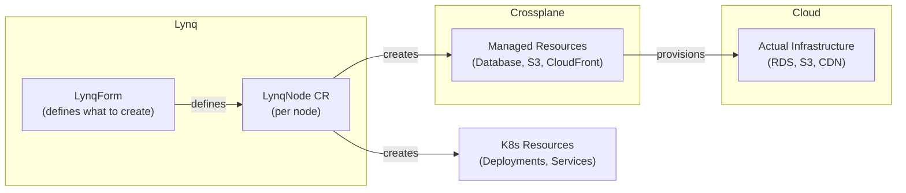

# Crossplane Integration

Combine Lynq with Crossplane to provision cloud resources (RDS databases, S3 buckets, CloudFront distributions) alongside Kubernetes workloads — all driven by database rows, managed as Kubernetes CRs.

::: tip Time to working
\~15 minutes to install Crossplane and provision your first database per node.
:::

## How It Works

* **Lynq** creates LynqNode CRs from database rows.
* **LynqNode controller** creates Crossplane Managed Resource CRs (e.g., `Database`, `S3Bucket`) alongside native Kubernetes resources.
* **Crossplane** watches those CRs and provisions the actual cloud infrastructure.
* Both operators work independently — Lynq orchestrates, Crossplane provisions.



## Prerequisites

* Kubernetes cluster v1.20+
* Lynq installed
* Crossplane v1.14+ installed
* AWS/GCP/Azure account with credentials

## Installation

### 1. Install Crossplane

```bash
helm repo add crossplane-stable https://charts.crossplane.io/stable
helm repo update
helm install crossplane crossplane-stable/crossplane \
  --namespace crossplane-system \
  --create-namespace \
  --wait
```

### 2. Install AWS Providers

```bash
cat <<EOF | kubectl apply -f -
apiVersion: pkg.crossplane.io/v1
kind: Provider
metadata:
  name: provider-aws-rds
spec:
  package: xpkg.upbound.io/upbound/provider-aws-rds:v1.1.0
---
apiVersion: pkg.crossplane.io/v1
kind: Provider
metadata:
  name: provider-sql
spec:
  package: xpkg.upbound.io/crossplane-contrib/provider-sql:v0.9.0
EOF

kubectl wait --for=condition=Healthy provider.pkg.crossplane.io --all --timeout=5m
```

### 3. Configure Credentials

```bash
cat > aws-creds.txt <<EOF
[default]
aws_access_key_id = YOUR_ACCESS_KEY
aws_secret_access_key = YOUR_SECRET_KEY
EOF

kubectl create secret generic aws-credentials \
  --namespace crossplane-system \
  --from-file=credentials=aws-creds.txt
rm aws-creds.txt

kubectl apply -f - <<EOF
apiVersion: aws.upbound.io/v1beta1
kind: ProviderConfig
metadata:
  name: default
spec:
  credentials:
    source: Secret
    secretRef:
      namespace: crossplane-system
      name: aws-credentials
      key: credentials
EOF
```

## Minimal Setup: Database per Node

This creates an isolated PostgreSQL schema within a shared database for each node — the most cost-effective pattern.

::: v-pre

```yaml
apiVersion: operator.lynq.sh/v1
kind: LynqForm
metadata:
  name: node-database
spec:
  hubId: customer-hub

  manifests:
    - id: postgres-schema
      nameTemplate: "{{ .uid }}-schema"
      waitForReady: true
      spec:
        apiVersion: postgresql.sql.crossplane.io/v1alpha1
        kind: Schema
        metadata:
          annotations:
            crossplane.io/external-name: "node_{{ .uid | replace \"-\" \"_\" }}"
        spec:
          forProvider:
            database: shared_db
          providerConfigRef:
            name: postgres-provider

    - id: schema-grant
      nameTemplate: "{{ .uid }}-grant"
      dependIds: ["postgres-schema"]
      spec:
        apiVersion: postgresql.sql.crossplane.io/v1alpha1
        kind: Grant
        spec:
          forProvider:
            privileges: ["ALL"]
            schema: "node_{{ .uid | replace \"-\" \"_\" }}"
            database: shared_db
            role: "{{ .uid }}_user"
          providerConfigRef:
            name: postgres-provider
```

:::

For a full production setup (RDS + S3 + CloudFront + Deployments + Ingress), see the [Full-Stack Walkthrough](integration-crossplane-fullstack.md).

## Crossplane vs Terraform Operator

| Feature | Crossplane | Terraform Operator |
|---------|------------|--------------------|
| API style | Kubernetes-native CRs | HCL in YAML |
| GitOps | Native | Requires abstraction |
| State storage | Kubernetes etcd | Separate backend |
| Provider count | 80+ (growing) | 3000+ (mature) |
| Composition | Built-in XRDs | Terraform modules |
| Best for | K8s-native teams | Terraform-heavy orgs |

## Caveats

* **Provider install time**: Crossplane providers are OCI packages that must be pulled and started. Allow 2-5 minutes after `kubectl apply` before providers are Healthy.
* **Cloud resource costs**: Crossplane provisions real infrastructure. Use `deletionPolicy: Retain` for databases to prevent data loss on node deactivation.
* **Timeout sizing**: RDS instances take 10-20 minutes. Set `timeoutSeconds: 1200` for dedicated instances. Set `waitForReady: false` for CloudFront (15-30 min) to avoid blocking node readiness.
* **Provider credentials**: Each Crossplane provider needs its own `ProviderConfig`. A missing or misconfigured config causes all managed resources to remain `NotSynced`.

## Troubleshooting

**Provider stuck in unhealthy state**

```bash
kubectl get providers
kubectl describe provider provider-aws-rds
kubectl logs -n crossplane-system -l pkg.crossplane.io/provider=provider-aws-rds
```

**Managed resource not syncing**

```bash
# Check provider config reference
kubectl describe database <name> | grep -A 5 "Conditions"
# "cannot get provider config" → ProviderConfig is missing or named incorrectly
```

**Node not becoming Ready**

```bash
kubectl describe lynqnode <name>
# Look for: ReadinessTimeout on Crossplane resources
# Fix: increase timeoutSeconds, or set waitForReady: false for slow resources (CloudFront)
```

## See Also

* [Full-Stack Walkthrough](integration-crossplane-fullstack.md) — Production example with RDS, S3, CloudFront, and Kubernetes workloads.
* [Dependencies](dependencies.md) — `waitForReady` and `dependIds` for ordered provisioning.
* [Policies](policies.md) — `deletionPolicy: Retain` for stateful cloud resources.
* [Crossplane Docs](https://docs.crossplane.io/) — Provider-specific CRD reference.
* [Upbound Provider Marketplace](https://marketplace.upbound.io/) — Browse available providers.
